# Slamby Insight
_Version: {{docversion}}_

Slamby Insight is an open-source project under <a href="https://raw.githubusercontent.com/slamby/slamby-tau/master/LICENSE" target="_blank">Apache 2.0</a> license. Please find it at [github.com/slamby/slamby-insight](https://github.com/slamby/slamby-insight)

----------------------------------

## Download, install

Download and install Slamby Insight from [https://insight.slamby.com](https://insight.slamby.com)

`Supported operating systems`

- [Apple Mac OSX](https://insight.slamby.com/download/osx)

- [Linux (Ubuntu, Debian)](https://insight.slamby.com/download/linux)

- [Microsoft Windows](https://insight.slamby.com/download/windows)

> `Automated Update:` Slamby Insight checks updates when it starts. When updates available a popup dialog displays and request permission for updates.

## Login

When Insight starts login window comes first. Here you can select or add your Slamby Server to work with.

> To use Slamby Insight you need to have a working Slamby API server. If you don't have one, you can try Insight using our public demo server.

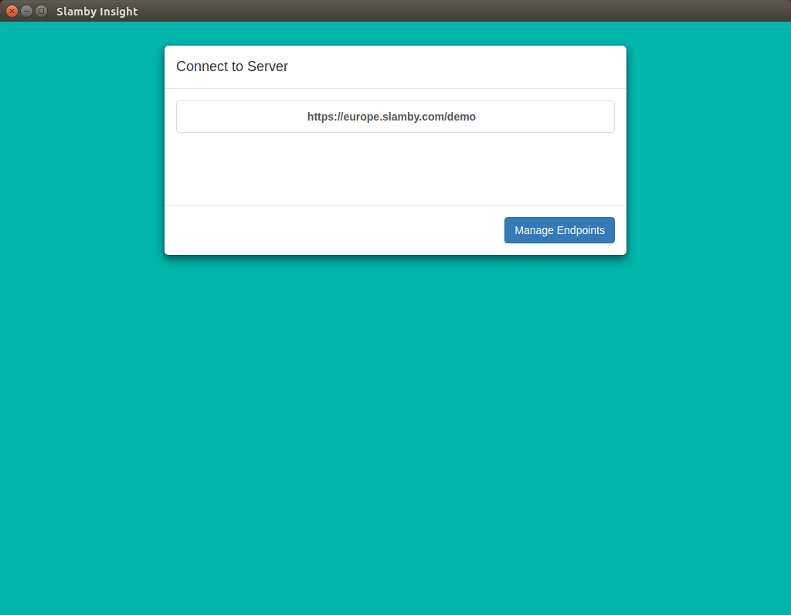

`Manage servers`

To add, edit servers click the Manage Endpoints button. A server editor pops up that lets you edit your servers.

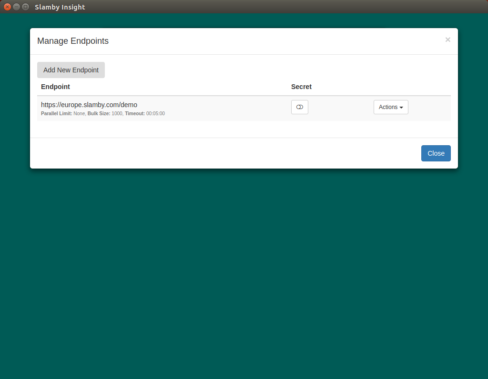

`Demo Server Data:`

The demo server is available in the server list as default.

*This is a Slamby hosted demo server in our European cloud*

Name    |   Default Value
--- |   ---
ApiBaseEndpoint |   https://europe.slamby.com/demo/
ApiSecret   |   s3cr3t
ParallelLimit   |   0
BulkSize    |   1000

## Welcome screen

When you log in your server the first panel you see is the welcome screen. Here you can check the software versions and find a quick link to our developer's site for more detailed information.

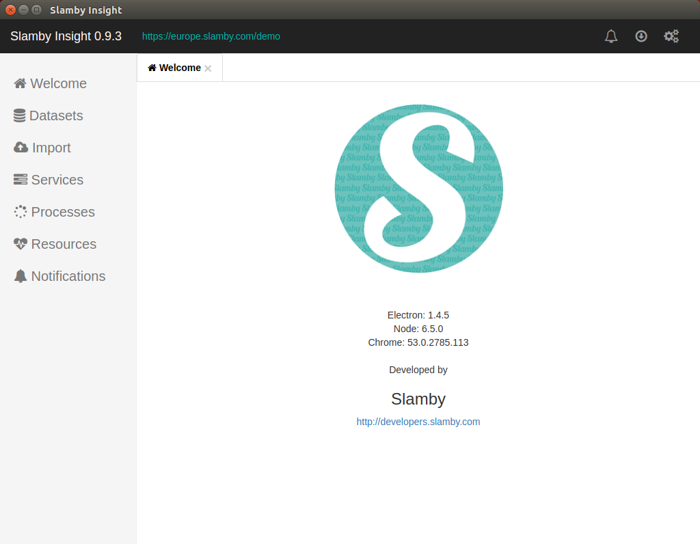

## Basic structure

Insight has a simple design structure. You can find the main menu panel icons on the left side as a vertical menu. To open one, use double click. When you open a menu panel it pops up as a tab. You can check the tabs in the tab section in the top middle section.

To close a tab click the `x` sign or press middle mouse button on it. When you have more tabs open that can be displayed horizontally, a horizontal scrollbar shows.

In the top dark header lane you can find you Insight version in the top left corner, then the selected server address. In the right header side you can find three buttons:

1. Notification button,

2. Refresh button,

3. Settings button.

When you server responses such as successful service activation, you can find the available notifications in under the notification panel.

For update check, you can click the middle button.

For server settings click the settings button.

## Dataset panel

This is the main panel for dataset management. List, create and edit and open your datasets. When you open this panel you see your available dataset list, a few information about them and an `Add New Dataset` button.

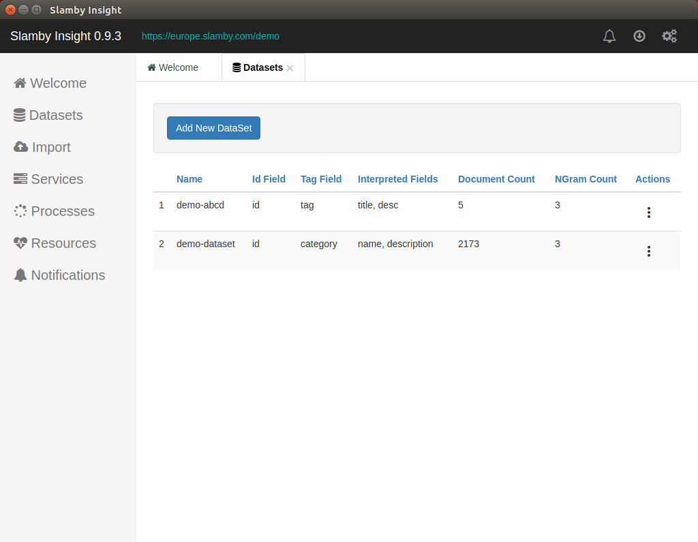

### Create new dataset

To create a new dataset click the `Add New Dataset` button. In the popup form, you need to provide a few information about the name and the required structure of the new dataset.

Available fields:

Field name   |   Description
---   |   ---
Name   |   Name of the new dataset. a-Z, 0-9 accepted.
NGram Count   |   Datasets using ngram model for text analysis. The suggested number is `3`
Id Field   |   As you can set any field in your sample/schema, then we need to know which field is the id field. The id field is a must.
Tag Field   |   In each dataset a tag field is a must. Tag field means the document related tags that we are going to use for text-analysis and category prediction. `Slamby API manages categories as tags.`
Interpreted Fields   |   For text analysis we need to know which fields contain text. For that, you need to set those field names here that contain text and you are going to use those text for analysis.
Sample document or Schema   |   To define which fields, data types and structure you wish to use in your dataset you have two options: using a JSON sample document, or use Schema.

> For more information please visit our developer's site [developers.slamby.com](https://developers.slamby.com)

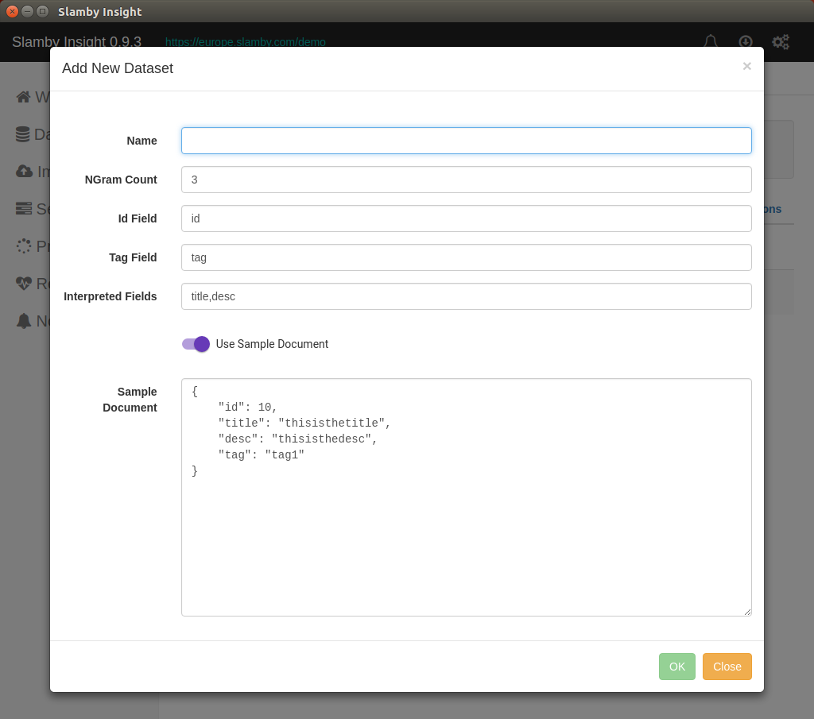

### Dataset management options

Available dataset management options:

- Rename

- Delete

- Clone

- Show sample document


### Rename dataset

To rename a dataset click the dataset options button on the right side. In the drop-down menu click the rename option.

Type the new name and click Ok.


### Clone dataset

When you want to copy a dataset with all the details but data; you can use the clone options. It copies all the settings and structure of a dataset, your only job is to name it.

To clone a dataset click the Clone option in the drop-down menu.

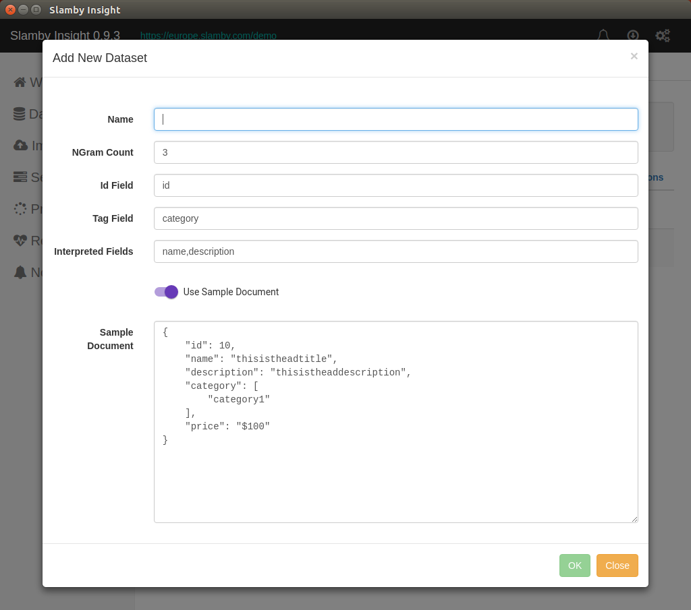

### Show sample document

When you need to now the available fields and types inside a dataset you can check the structure it by clicking the Show Sample button in the drop-down dataset menu.

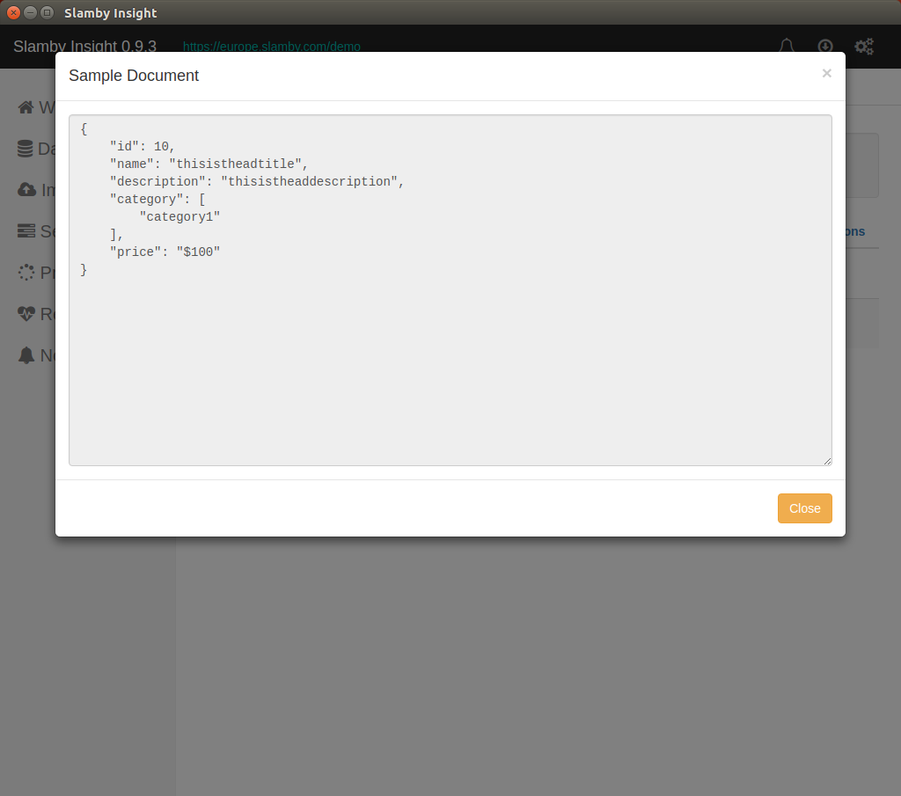

### Remove dataset

To remove a dataset click the remove button in the drop-down dataset menu. You can delete a dataset when there is no related active service running.

> `Important!` Removing a dataset cause data loss, there is no way for recovery.

## Import panel

To import documents or tags into a dataset you can use our built-in import panel. To open the import panel double click it on the left menu.

At first select the target dataset, then select the import file on your computer. Currently the supported file formats `CSV` (both for documents and tags) and `JSON` (just for tags).

Please find this sample CSV content to test the document import process. Copy and save it as slamby-demo-import.csv.

```json
"id","title","desc","tag"
"1","A","A","1"
"2","B","B","1"
"3","C","C","2"
"4","D","D","2"
"5","E","E","3"
```

You can use the import panel to import both documents and tags. To select the required one use the selector.

When everything ready click the import button.


When you use CSV as a file format a delimiter field pops up. Here please provide the required delimiter.

When it's done, click the import button for start.

> `Important!` In the source file using CSV, a header row is a must. Your source file should contain each dataset field and it should have the same field names.


## Documents

To manage your documents inside a dataset use the document panel. First, open dataset panel, select the required one and double-click it, or select the open menu item in the drop-down menu.

`Basic window structure`

After opening documents tab you can see a bit complex window. In the header part, you can switch between the document or tag view.

Before the sub-selector, there is a helper panel with filter, sample, and field selector. To use it click the panel and it drops down.

Here you can see three columns. The first section is the field selector. Here you can see the available dataset fields, and you can filter them to display.

The second section is a Filter panel, where you can filter your documents by tag or by search query. The search results will be displayed in the document list.

The third section is the sampling module. You can use it to create statistical samples from your dataset. You can set the sampling mode, size, and the tags. 

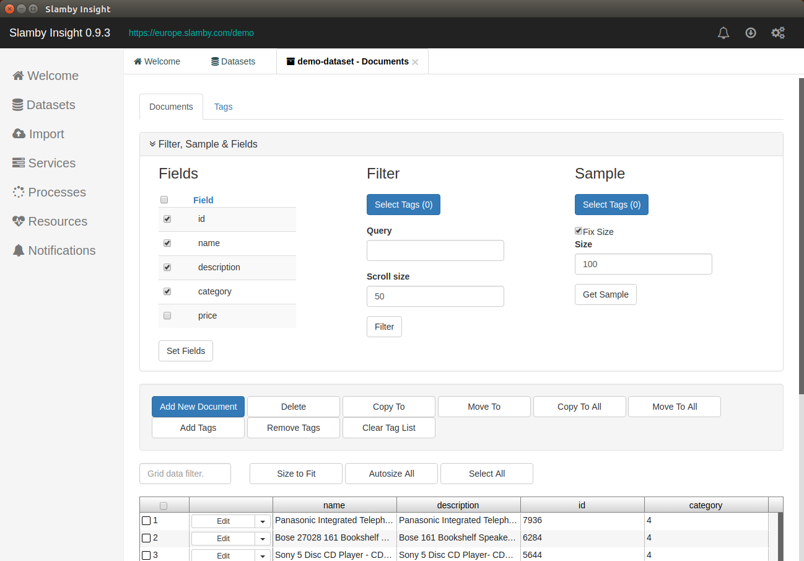

The second biggest section is the document list. This list displays the selected documents. Here you can manage the documents by one, or as bulk.

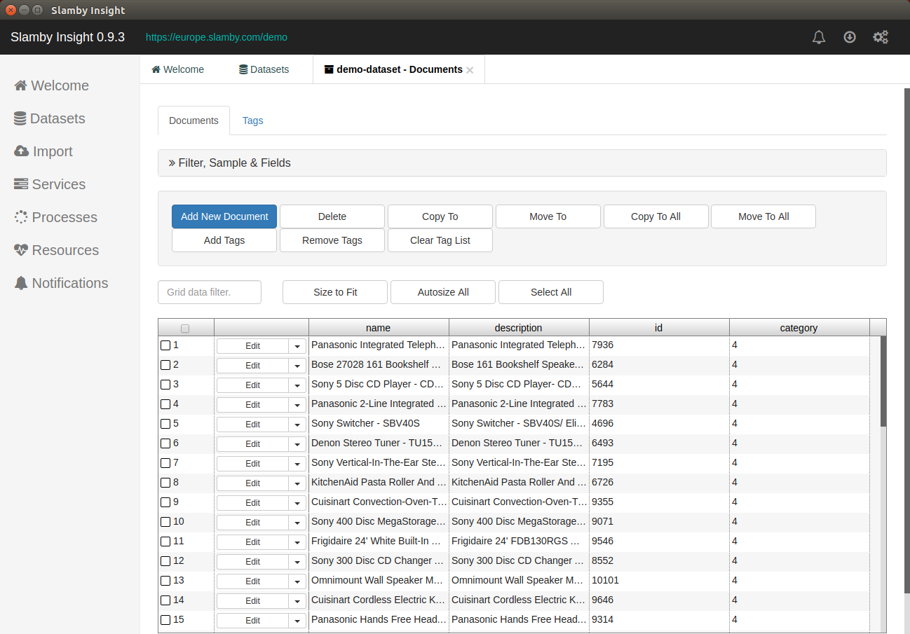

Managing a document you can use the drop-down menu by documents.

`Available menu options`

Menu Option | Description
--- | ---
Preview | Open the document in the pop-up window.
Open | Open document in a new tab.
Edit | Open the document to edit.
Copy to | Copy document to a selected dataset.
Move to | Move document to a selected dataset.
Add tags | Add tags to the document from the dataset list.
Remove tags | Remove the selected tags from the document.
Clear tags | Remove all the tags from the document.
Delete | Delete the document. `There is no recovery option!`


### Bulk document actions

There are two bulk options available:

- Copy all documents to another dataset,

- Move all documents to another dataset.

To manage it click the `Copy All To` or `Move All To` button. After clicking them a tag selector pops up, here you can select the target dataset.

> `Important!` the target dataset must have the same data structure than the source one. To create one easily you can use dataset clone.

### Add new document

To create a new document manually, click the `Add new document` button. A document editor pops up with the sample document of the dataset. You can copy and paste your document here, or re-write the sample document to the required data.

> `Important!` document must have a valid JSON format.

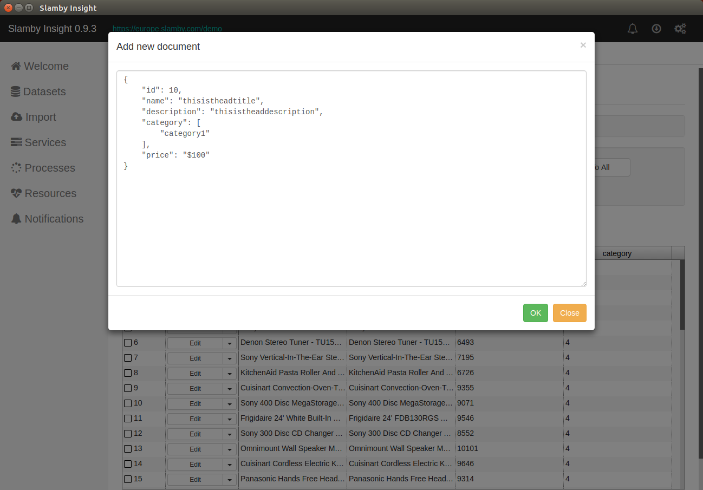

### Managing tags

This is the panel where you can list, add and edit your available tags in a dataset.

Here you can see all of your available tags. To filter them use the built-in filter in the table header. 

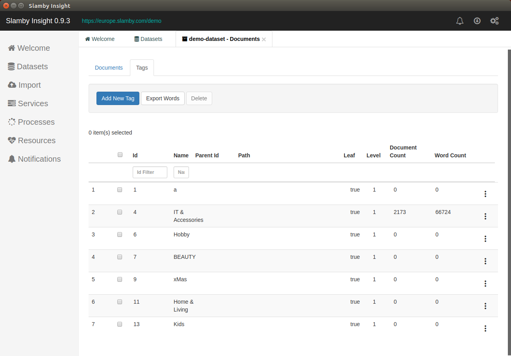

To add a new tag click the `Add new tag` button. Here provide the tag id, name and the parent id. When you use a category tree, then you can organize your tags into a hierarchy by child-parent relations. When you manage a tag cloud instead, just leave the parent id as empty.


> To export all the words from your database for further analysis, click the `Export Words` button; a long-term process starts.

## Services panel

Main panel for service management. List, create and manage your available services. Currently, Slamby supports the following type of services:

- Classifier,

- PRC,

- Search.

`Classifier service` is a text-classification service with high accuracy level and language independence. Specialized for e-commerce text-classification and category-recommendation for thousands of categories.

`PRC service` is a text-based matchmaking service for matchmaking, keyword extraction, and duplicate finding.

`Search service` is a smart search service, creating powerful search engine. Elastic Search engine, built-in typo fixing, category recommendation, wide-range of customization.

To create a service click the add new service button by selecting the required service type.

Each service has 3 state depends on the preparation and activation status:

- New,

- Prepared,

- Activated.

`Meaning of different service status`

Status | Description
--- | ---
New | When a service is just created it has a name, description, and an alias. The first status is `new`. This service has no settings provided, it's not prepared, you cannot activate it. To use it you need to continue with a preparation process.
Prepared | This is a status when a service is `prepared`, all the settings and background machine-learning process done. For preparation click the prepared menu and provide the required settings for the training such as the source dataset name, and needed tags. When the status is prepared, the service is ready for use, however, you need to activate it first.
Activated | Just the activated services are callable. When a service is prepared you can start the activation process by clicking the activate menu. During the activation process, all the required files and settings are loading into the machine memory. When a service is activated you can use it by id or by alias.


### Add Classifier Service

To add a classifier service, click the `Add Classifier` button. For start provide the required name, alias, and description.

`What to know about the input parameters?`

Field | Description
--- | ---
Name | Name of the service. Human readable name for better management. You cannot modify it in the future.
Alias | Service alias for flexible integration. You can set and modify it in the future.
Description | Human readable description for better management.


### Prepare Classifier Service

When you need a Classifier Service, the second step is the preparation process. This is the process when based on the provided settings the machine-learning process starts.

`Available settings`

Field | Description
--- | ---
Dataset | Dataset selector. Choose the source dataset that you want to use for the training process.
NGramCount | Default value is 3, or the maximum ngram number of the dataset.
TagIdList | Popup tag selector window where you can pick the required tags. If you want to create a classifier service that can use just the first level categories from the tree, then select just the first level tags.
CompressLevel | Built-in compress engine settings. Set it 1 as a default value, it will compress the results by analyzing the unnecessary words, remaining lower resource need at the same accuracy level.
Compress Settings | Custom compress settings. For more information visit the [developers site](https://developers.slamby.com).

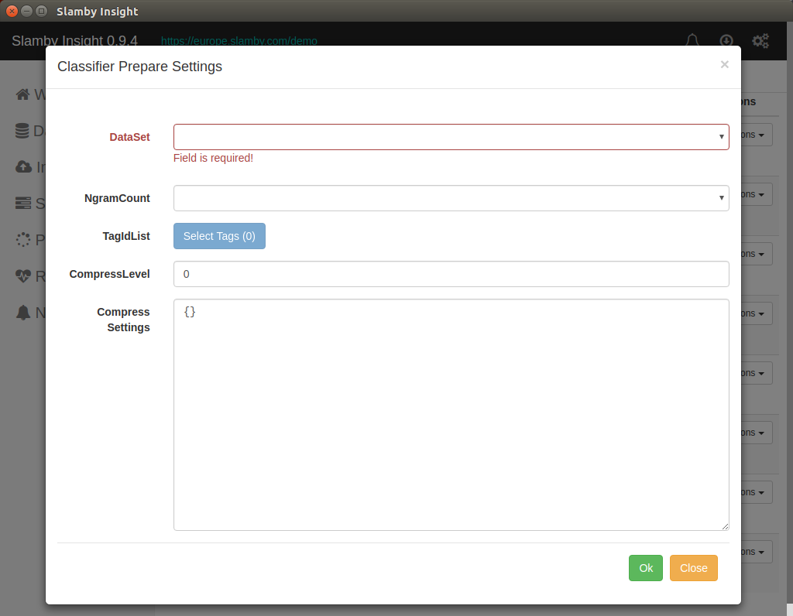

### Activate Classifier Service

When a Classifier Service is prepared activation available. For activation, you can use custom settings to specify you usage criteria.

`Available Classifier activation service`

Field | Description
--- | ---
NGramCount | Ngram model that you want to use for your activated service. The default value is the maximum prepared ngram value.
TagIdList | Tag id filter from the available prepared tag list. You can filter which tags you want to use for category recommendation.

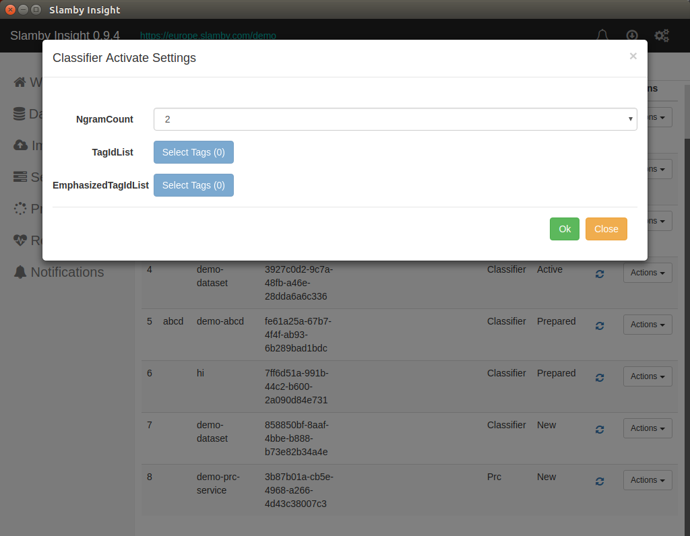

### Recommend for Classifier Service

To try an activated Classifier service, click the recommend menu. Here you can set the text for analysis, the required response count. When you want a detailed response click true the NeedTagsInResult.


`Classifier Recommend Response`

After sending a recommend query to the selected service, the response pops up immediately. In the response the following parameters available:

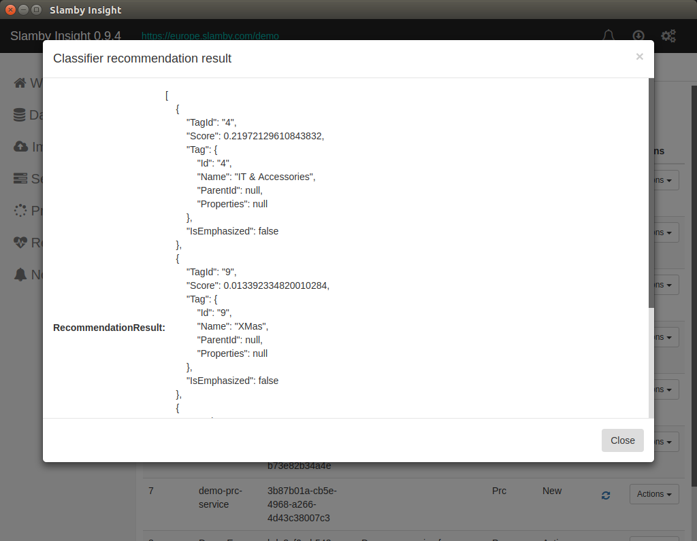

### Add PRC Service

To create a PRC Service 3 parameter required: `name` as a human readable text, `alias` for flexible integration and `description` for more detailed human-readable text for better service management.


### Prepare PRC Service

For preparation the required fields:

Field | Description
--- | ---
Dataset | Select the source dataset for training.
TagIdList | Tag selector for training. When there is no tag selected, by default all the lead tags are selected.
CompressLevel | Built-in compress engine, recommended value is 1.
Compress Settings | Custom compress settings, for more details visit the [developers site](https://developers.slamby.com).


### Activate PRC Service

For activation please check which field you want to use as a recommendation / matchmaking source. When you check a dataset field, during the text-analysis the PRC service will provide the matched items based on the selected fields.


### Recommend for PRC Service

To try your activated PRC service, click the Recommend menu. The available options:

Field | Description
--- | ---
Text | Text for analysis
Count | Response item number
Filter | PRC filter as a pre-filter before matchmaking. For more information please check the API documentation.
NeedDocumentsInResult | When it's true response contains full document objects.
TagId | The target tag id, in which the matchmaking will be processing. When it's empty, the API will predict a suitable one.
Weights | Weight object to boost the results. For more information please check the API documentation.

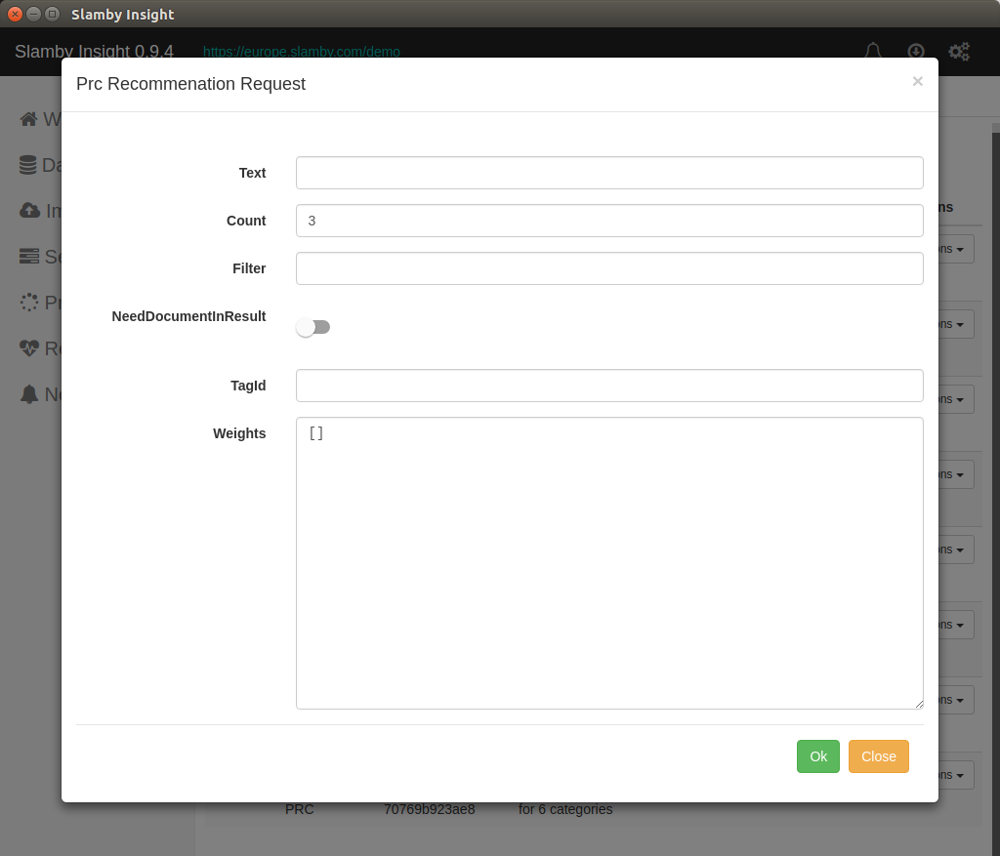

### Keywords extraction for PRC Service

You can extract keywords from text with this function. The available options:

Field | Description
--- | ---
Text | Text for analysis
TagId | The target tag id, in which the matchmaking will be processing. When it's empty, the API will predict a suitable one.
Strict mode | If it's enabled then you will get lesser keywords. The score limit is stricter.


### Add Search service

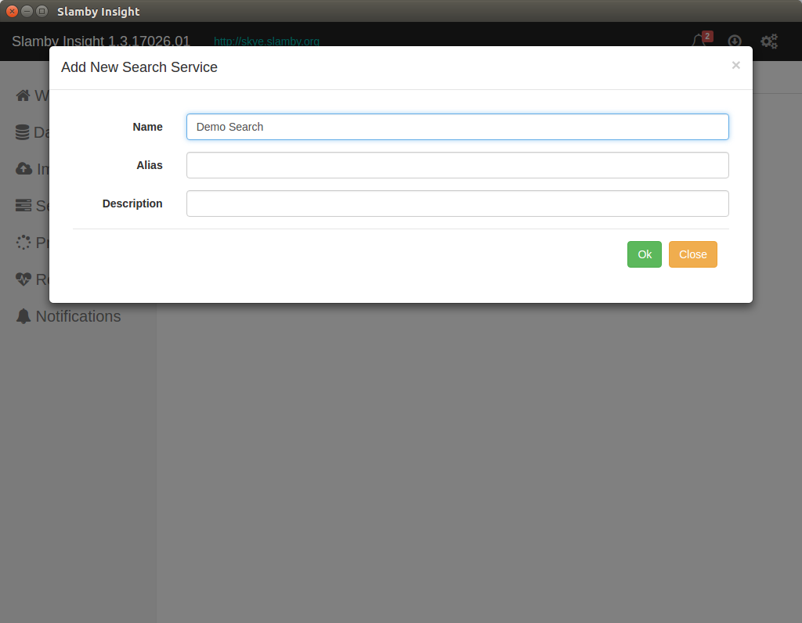

### Prepare Search service


### Activate Search service

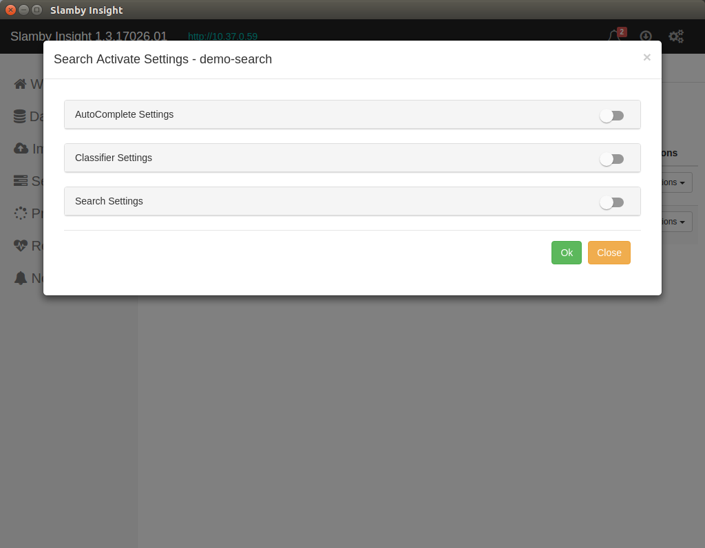

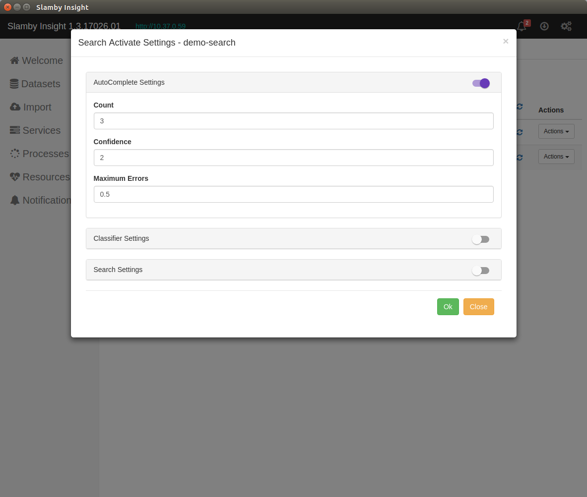

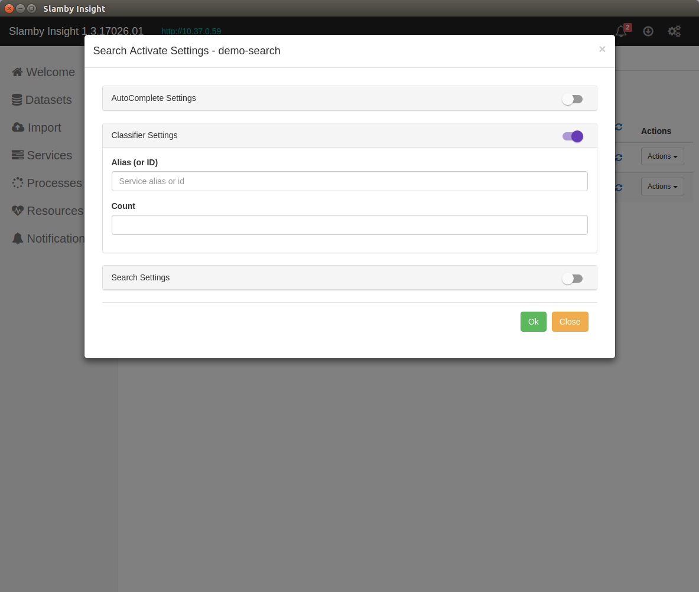


### Using Search


## Processes

Using Slamby API server all the long-term jobs are organized into background processes. Such as dataset copy or classifier service training are managed using background processes.

Open processes double click on the processes menu.

Here you can see all the active processes: result, timing details, status, description and other details. To check the historical, not active processes check the `Show inactive processes`


## Notification

Notification panel for Insight and API messages. Here you can list all the historical notifications received during your session.


## Resources panel

Panel for better resource management. Here you can check the available server resources.

`Resource information`

name | Description
- | -
API version | Current API version number.
Number of CPU core(s) | Available core number.
CPU usage | CPU usage in percentage.
Available free disk space | Free disk space in MB.
Free memory / total memory | Memory data in MB.

