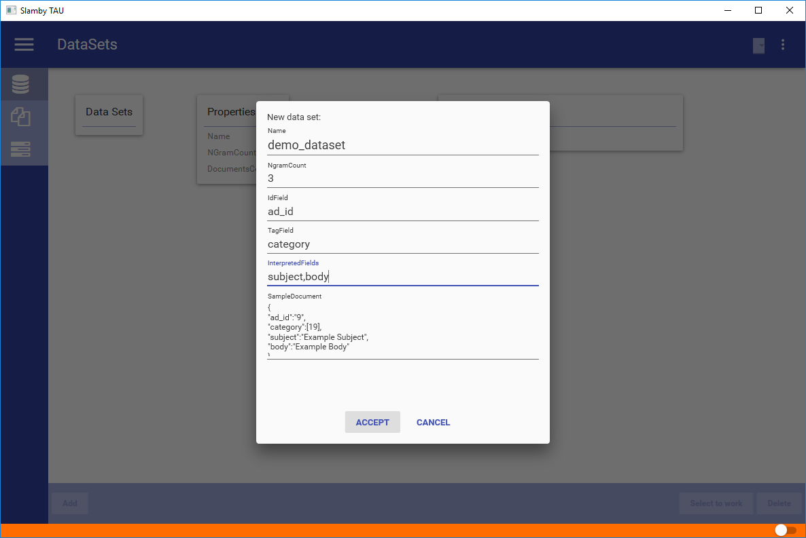

## Dataset

First main section. Managing datasets.

> In Slamby you can create your databases as datasets. A dataset is a schema-free JSON storage, with robust indexing, clustering and analytics. 

Available functions:
- Create Dataset,
- Remove Dataset,
- Set Dataset to Work,
- Open Dataset to Work,
- Clone Dataset.

### Create a Dataset

To create a dataset you need to fill a form with the following parameters:

`Name`: name of the dataset. Use A-Z,a-z,0-9_ characters.

`NgramCount`: Maximum n-gram value of your database. `Default value is 3`.

`TagField`: the tagfield name from your sample JSON document.

`InterpretedFields`: fields from your sample JSON document which contains text to analyze.

`SampleDocument`: sample JSON document to define your dataset's schema.

> Tip: use the built-in JSON validator.

### Select Dataset To Work

To select a dataset to work, click on `select to work`, or double-click on it. You can check the selected dataset in the header - in the dataset selector.

### Import Document into Dataset

To import document into your dataset, select your target dataset, right-click and select Import Document from ... menu item. You can select Import Document from JSON or from CSV.
After selecting the right import format, you can select the source file using your file browser.

After selecting the source file - a setting window pops-up. Here you can set the delimiter that will apply during CSV parsing. There is also a force import checkbox.

`Using force mode`, all the errors will be detected and reported, but the import will be continued anytime. Not using Force mode, import process will stop when the first error detected.

**CSV Import**

Import from CSV source. Built-in bulk process is automatically activated.
Reading and parsing is partial, there is no memory leak threat.

**JSON Import**

Import from JSON source. Built-in bulk process is automatically activated. Source file is loaded into memory, than during the parsing, bulk upload is available.
`Avoid memory leak`.

#### Format and Fields

In the CSV or JSON template file - you should use the same field names just in your dataset template. Filed match process is automated.

> Tip: during CSV import you can set the bulk import number in the settings.
 

#### Import Progress Bar

When import starts a progress bar pops-up. You can see the estimated progress, the successfully imported document number and the error number occurred.

### Import Tag into Dataset

Each dataset has a tag storage. You can easily create and manage your tags. During tag import you can use JSON or CSV format. To import tags, select the target dataset, right-click and select Import Tag from CSV or JSON.
After selecting the right import process select the source file using file browser. A setting window pops-up to select the delimiter and the force option.

**Important**

Format and field names are given. `Id, Name, ParentId`.

*Sample Category CSV*

Id  |   Name    |   ParentId
--- |   ---     |    ---
7   |   Animal  |   Null
9   |   Dog     |   7
10  |   Cat     |   7
11  |   Chihuahua    |   9

> Tip: organize your tags into hierarchy and use it as a category tree.

### Remove Dataset

To remove a dataset select your target dataset, right-click and select *Remove*. A security window pops-up, to make sure you are going to remove the right dataset. After pressing Ok, the dataset is going to be removed.

**Important**

After removing a dataset, each documents and tags will be removed.

> Tip: to delete all your documents it's faster to remove and re-create the given dataset.

### Clone Dataset

Clone an existing dataset. Copy settings and dataset schema to modify, or save.

