## Documents

In Documents tab the main focus is to manage your live dataset.

Available functions:
- Add new document,
- Create complex search queries,
- Create statistical, random samples,
- Edit your documents,
- Copy or Move your document into another dataset,
- Manage your tags related to given documents.

> Tip: managing documents use the available right-click options.

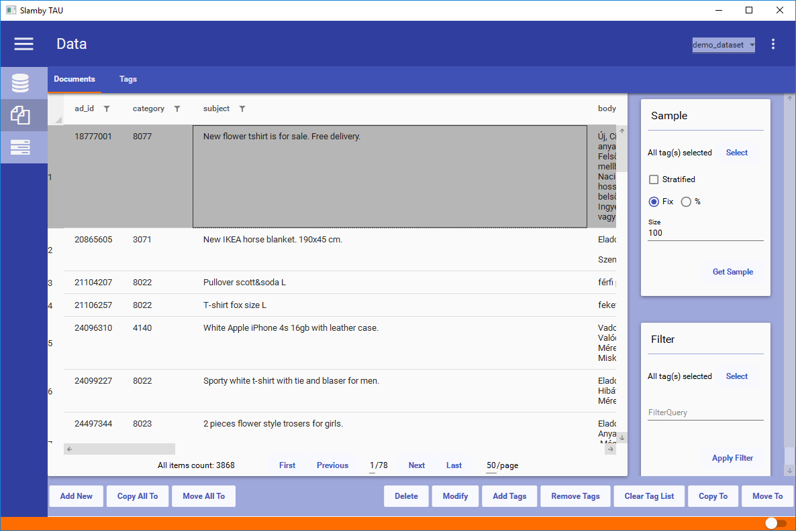

### Add New Document

Adding a new document you use json format. In the editor you can see the json document template that you used during the dataset creation process.
Change the template document with your content.

To save the document click Ok.

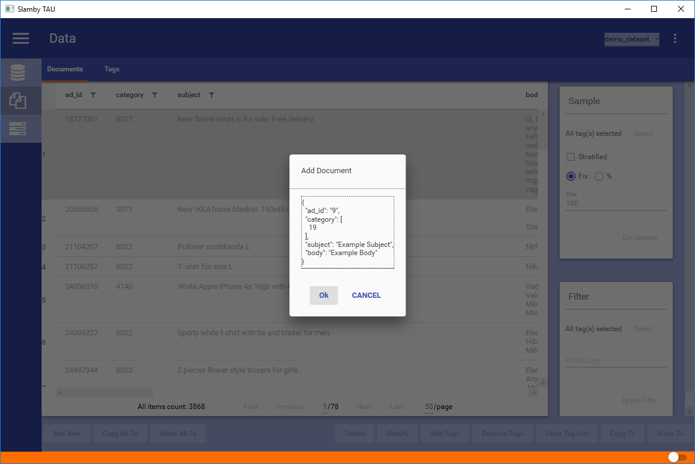

### Copy To, Copy All To

Copy the selected documents to another dataset. Pops up a target dataset selector, showing your available datasets. Select your target dataset and click on Select.
Copying process starts in the background.

To copy all of your documents from your entire dataset use `Copy All To` option. Using this option it's not necessary to select any document, it will automatically affect each of it.

**Important**

The target dataset should have the same template then your current dataset to copy your documents.

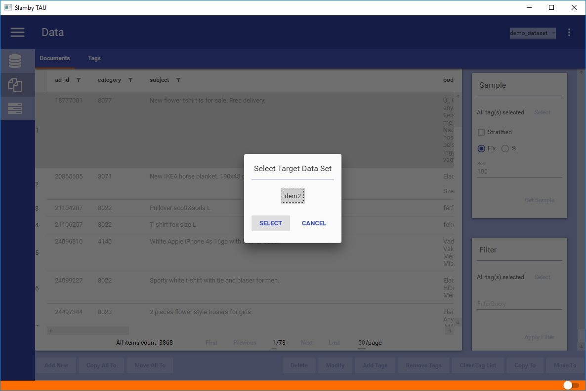

### Move To, Move All To

Move the selected documents to another dataset. Pops up a target dataset selector, showing your available datasets. Select your target dataset and click on Select.
Moving process starts in the background.

To move all of your documents from your entire dataset use `Move All To` option. Using this option it's not necessary to select any documents, it will automatically affect each of it.

**Important**

The target dataset should have the same template then your current dataset to move your documents.

### Remove Documents

Removes the selected documents from your dataset. Pops up a confirmation window to confirm your action.

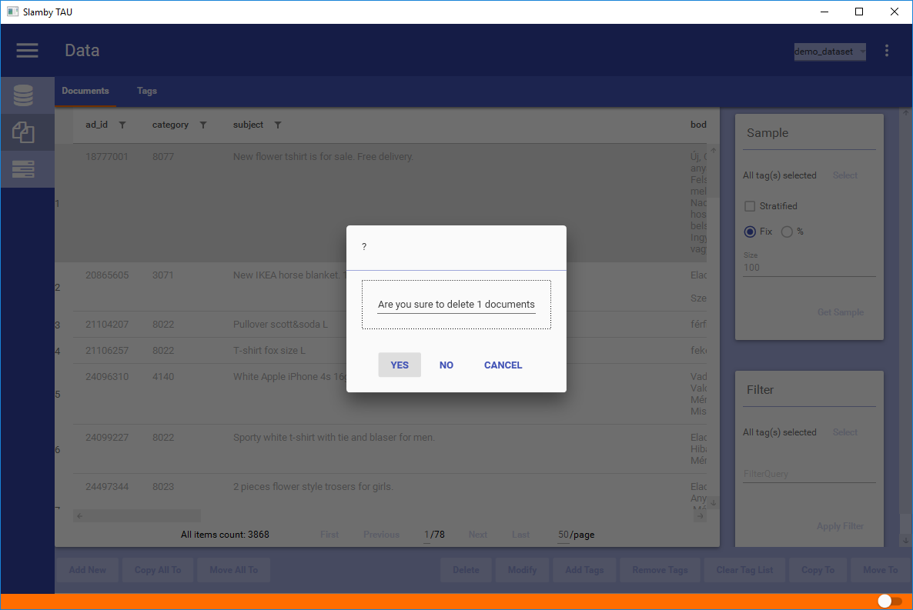

### Edit Document

Document JSON editor pops up. You can see your json document to edit. After editing click ok. Changes are automatically saved into your dataset.

> Tip: use built-in json validator.

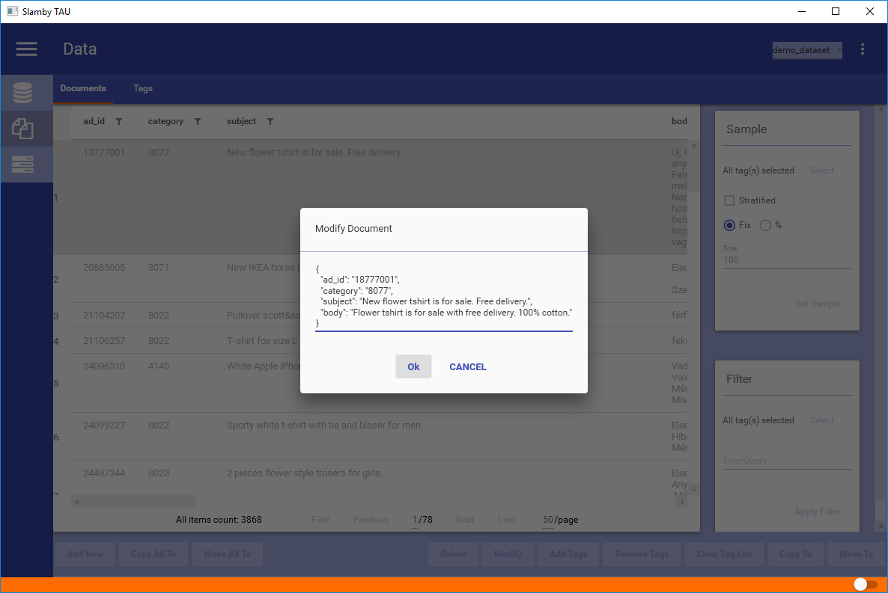

### Add Tags

Adding tags to a selected document manually. Pops up a tag selector. You can see your full tag list. Using built-in filter option you can select your required tags.

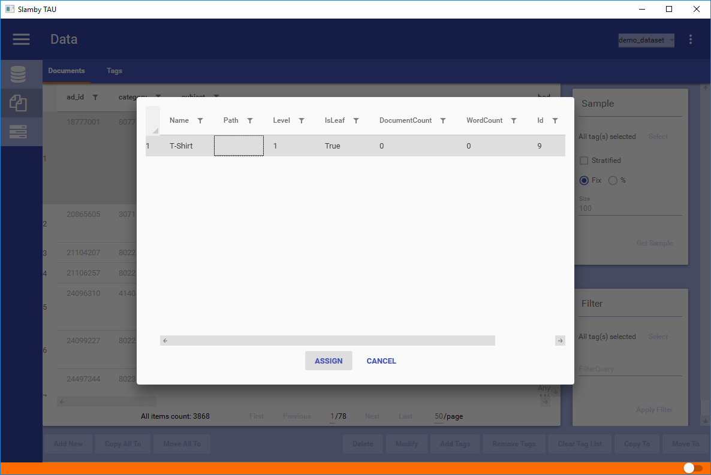

### Remove Tags

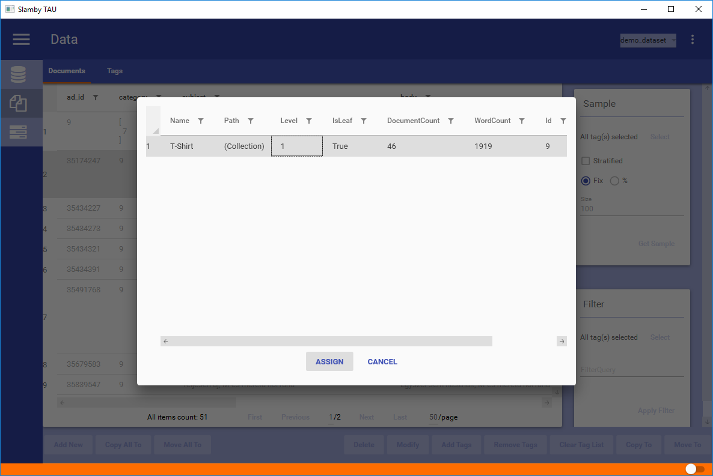

### Clear Tag List

Removes tags from selected documents instantly.

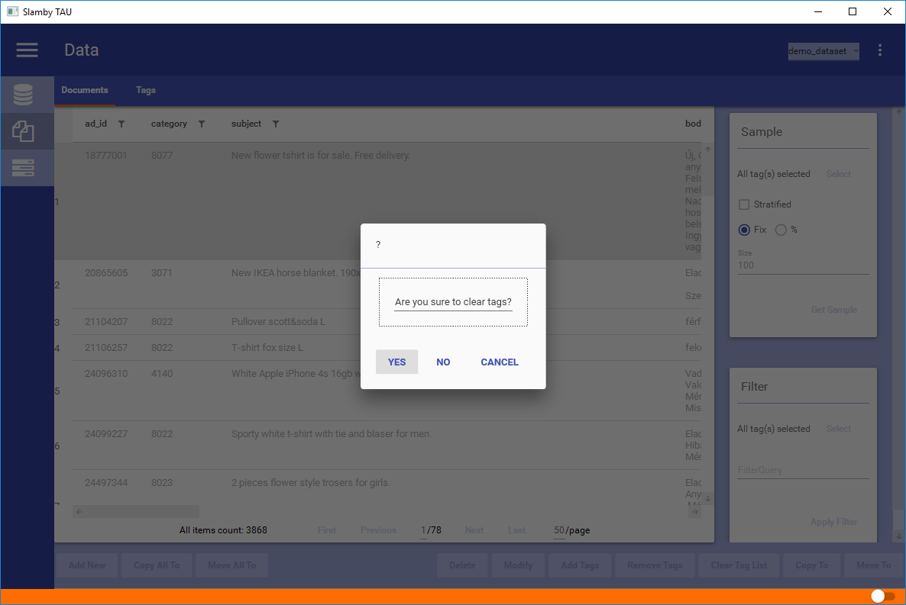

### Sampling

Create random selection from dataset.
Available options:
- Filter by tags,
- Stratified or Normal sampling procedure,
- Fix number, or % sample size definition,
- Sample Size definition.

*Filter by tags*

You can select from which tags you would like to create your samples. For a general e-commerce sampling a typical usage: select all the leaf level tags and use them for sampling.

*Sampling procedure*

You can use normal sampling, using your fill dataset-part as the whole dataset, then using a statistically random selection process.
Using Stratified method, sampling will be created tag by tag, using the same size declaration process.

> Tip: for general e-commerce sampling use normal sampling procedure.

*Sampling Size Definition*

You can define your sample size in pre-defined number or %. Using a fix number such as 10000, your sample size will be 10 000. Using a 10% relative sample size in the case of have a dataset with 1 million documents, the sample size will be 100 000.

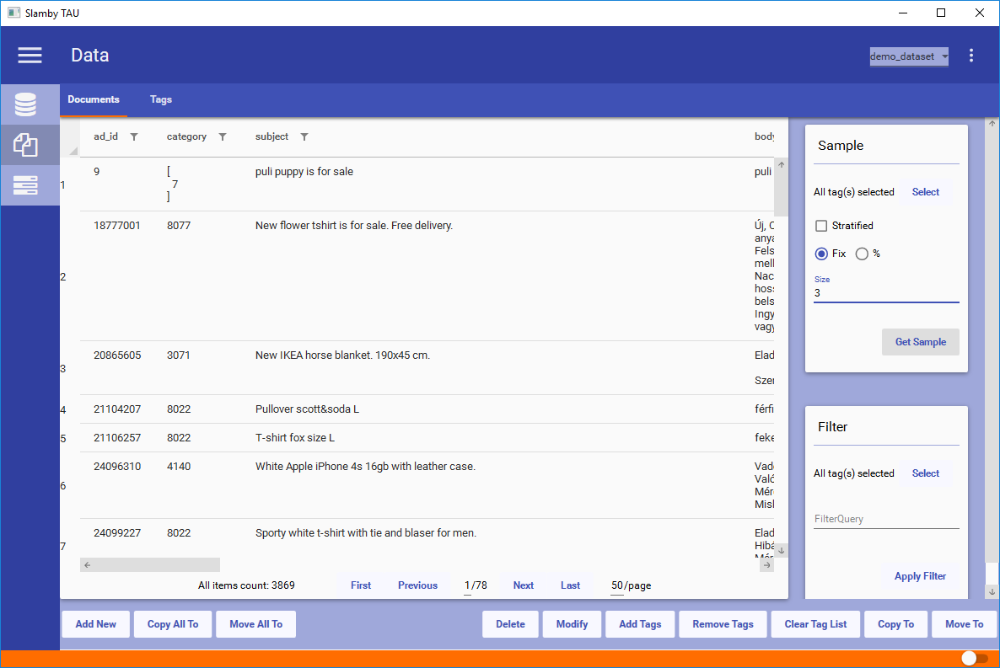

For tag filtering use our built-in tag selector:

*Example Filter Result - using fix size (3), non-stratified sample from each categories:*

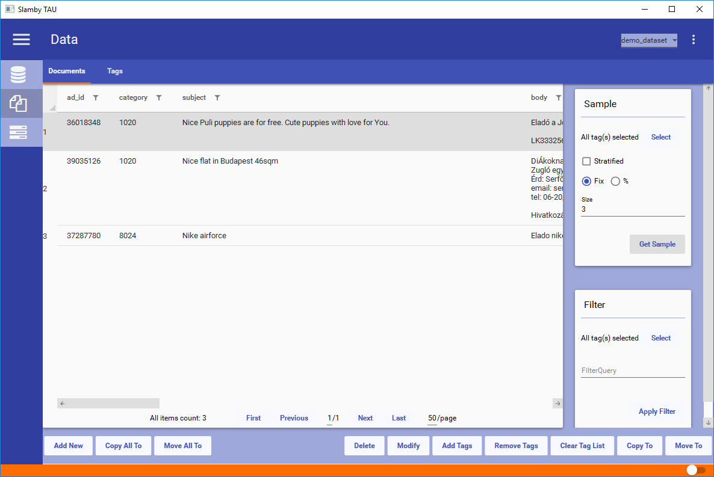

### Filter

Use filter for complex search processes.

With Filter you can:
- Filter by tags,
- Filter by any fields,
- Use Logical Expression,
- Use Wildcards,
- Use multiple queries with hierarchy.

*Filter uses built-in search engine with powerful and fast search capabilities.*

> Tip: build powerful, real-time search function using Filter.

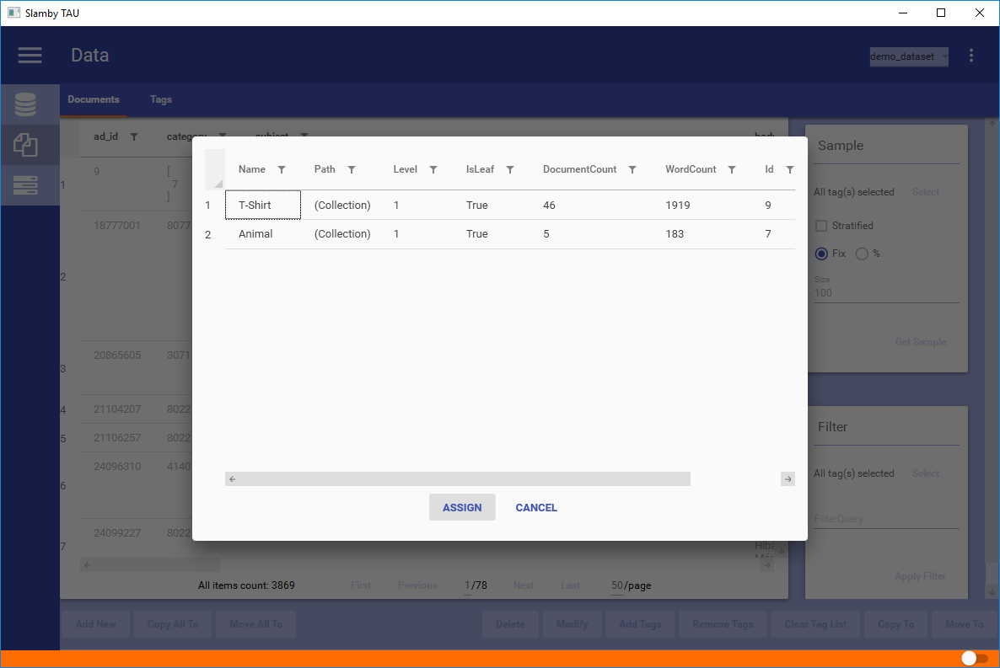

*Example Search Query and Result - with multiple queries with hierarchy:*

