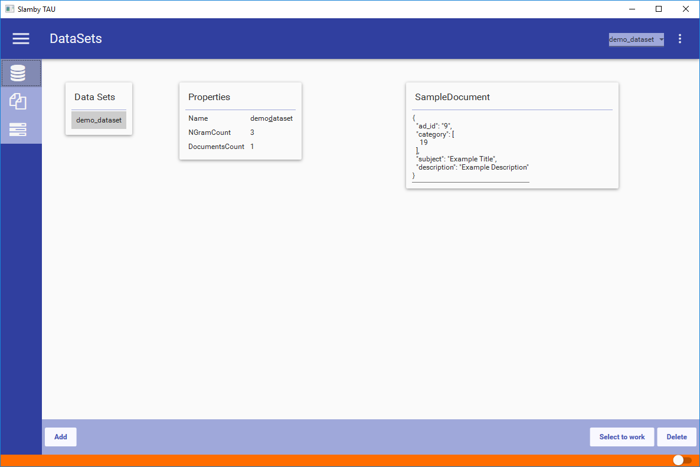
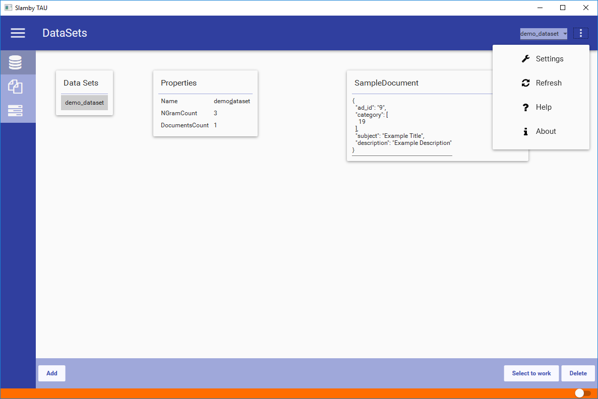
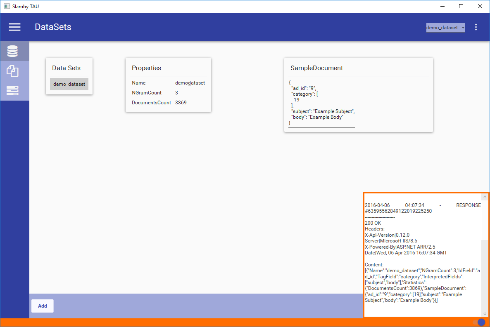

## Quick Overview

First let's examine TAU structure, logic and main parts:

Part Name   |   Description
--- |   ---
Header  |   Top navigation area, displaying the opened tabs, active processes and drop-down settings.
Left Menu   |   Main menu selector is on the left sidebar, displaying the main menu items. Currently Dataset, Services, Processes and Resources Monitor are available.
Status Bar   |   Orange colored status bar at the bottom. Contains additional information and status window button.

*Example TAU print screen*:

### Header

#### Opened Tabs

From version 0.14.0, TAU contains a tab control providing the option to open multiple menu items or data sets. You can open new tab by double click on menu item or dataset.

> Tip: You can split the UI by drag and drop tabs.

#### Active Processes

Quick access to current running processes.

#### Settings

Drop-down settings menu at the top right corner.

*Available Menu Items:*

Name    |   Description
--- |   ---
Settings    |   Available TAU configuration settings. *Server Settings:* Slamby Server URL & API Secret, *BulkImportSize*: bulk size during import process. Version: Show the current and the available TAU versions. Version install: Right click -> Apply
Refresh |   Refresh TAU. Shortcut key: `F5`.
Help    |   Open Slamby Developers site http://developers.slamby.com.
About   |   Slamby TAU and SDK Version number.

> Tip: use Refresh by pressing F5

*TAU drop-down settings menu*:

### Left Menu

Main navigation. Available Menu Items:
- Dataset
- Services
- Processes
- Resource Monitor

### Status Bar

Orange colored status bar in the bottom. Quick access to descriptive data. Contains Status Window.

#### Status Window

Displays full server-client communication. You can check each request & response manually.

> `Tip:` Use Status Window to analyze your queries to help integration.

> `Warning:` When status window is open, loaded data can cause memory issue.

