# Slamby TAU
_Version: {{docversion}}_

*Great application to manage your Slamby Server, access your datasets, documents, import and machine-learning training.*

`GitHub` Page: [https://github.com/slamby/slamby-tau/](https://github.com/slamby/slamby-tau)

License: <a href="https://raw.githubusercontent.com/slamby/slamby-tau/master/LICENSE" target="_blank">Apache License 2.0</a>

----------------------------------

## Download, Install

Download TAU from [here](https://tau.slamby.com/install/1.0.2/setup.exe)

It currently supports just Microsoft Windows 8 or later.

To install TAU download setup.exe and execute it. You can install it by double click the setup.exe. When install process is ready, tau starts instantly.

## Login

When TAU starts Login window comes first. Here you can select or add your Slamby Server to work with.
As default settings, you can find our demo server to try it out.

For a better user experience, multiple servers can be registered. To edit an account, select it by one click, thin click on the edit button.

`Available settings:`

Name    |   Default Value   |   Description
--- |   --- |---
ApiBaseEndpoint |   https://europe.slamby.com/_server_name  |   Account/server address. Each Slamby Server has a web address as a primary address.
ApiSecret   |   s3cr3t  |   Each Slamby Server has a password(secret). Contact your Slamby consultant to get your secret.
ParallelLimit   |   0   |   You Slamby Server has multiple processor cores and threads. Here you can set the required thread number that you wish to use during working with your server.
BulkSize    |   1000    | During import process TAU is using bulk import. This value set the default bulk size for bulk import.

`Demo Data:`

Name    |   Default Value
--- |   ---
ApiBaseEndpoint |   https://europe.slamby.com/demo/
ApiSecret   |   s3cr3t
ParallelLimit   |   0
BulkSize    |   1000

*Login window example*:

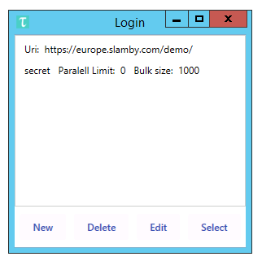

*Account settings example*

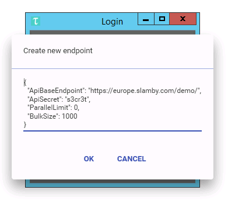

## Settings, about

To manage your settings, TAU you can use the settings menu located in the top right corner.

`Available menu items`:

Name    |   Description
--- |   ---
Settings    |   Settings menu icon. Click here to open settings, version and account tabs.
Refresh |   Refresh button. Use it to refresh TAU and reload data from the server. Shortcut: F5
Help    |   It directs you to the developer's site for detailed documentation.
about   |   General about section. You can use it to check the version of your TAU, Server.

*Dropdown settings menu*:

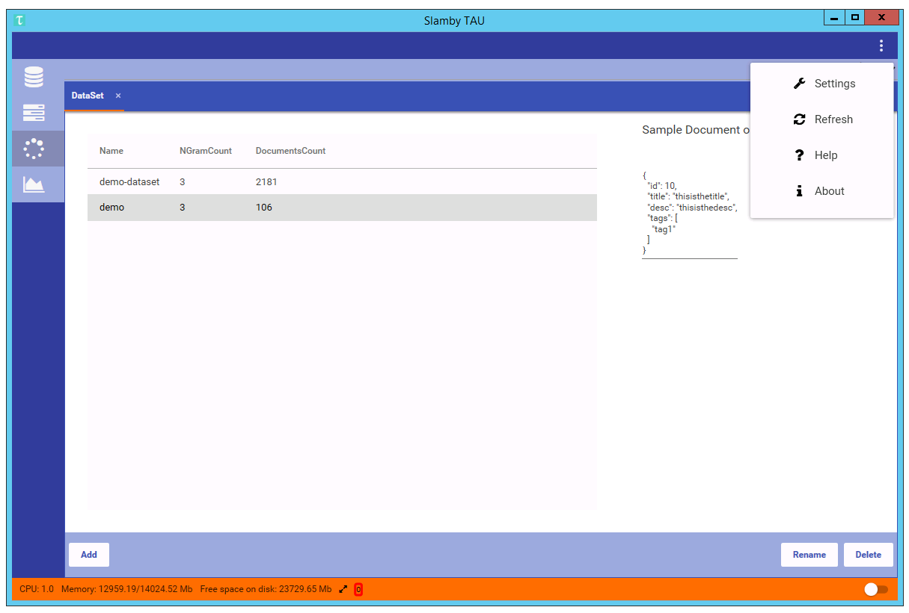

*Endpoint editor*:

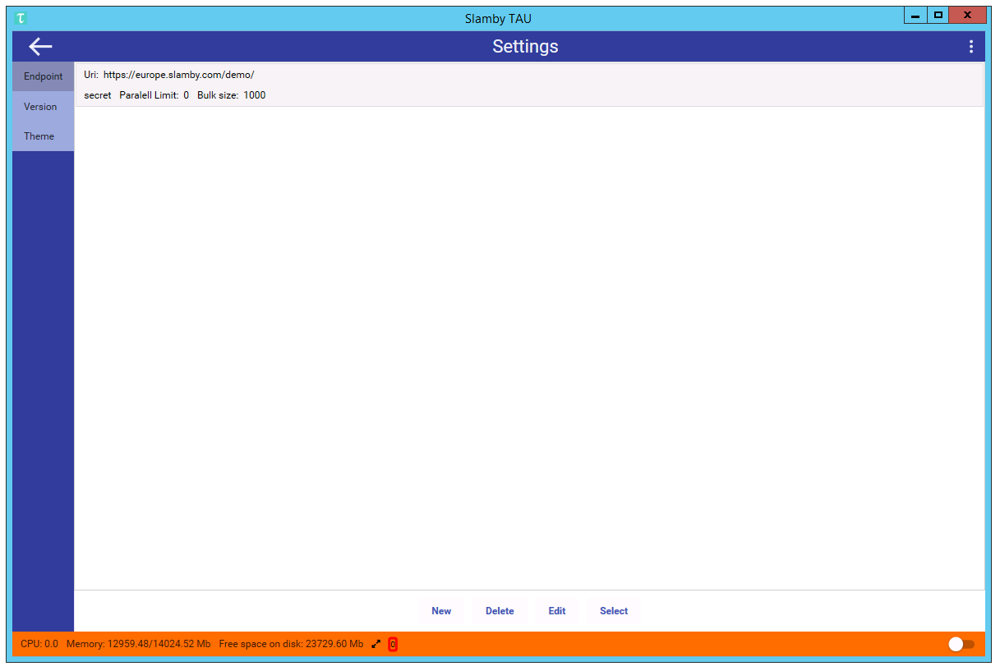

*TAU version manager*:

To update your TAU right-click the required version then click apply. TAU download the selected version and update itself. All the settings will be migrated.

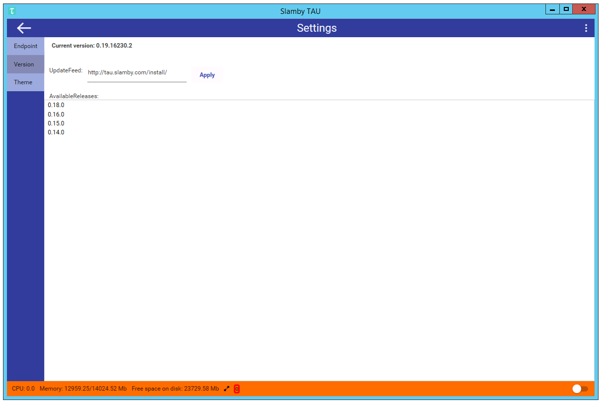

*TAU version manager in developer mode*:

To access the latest pre-release versions change the install feed to https://tau.slamby.com/install_develop/ then click apply.

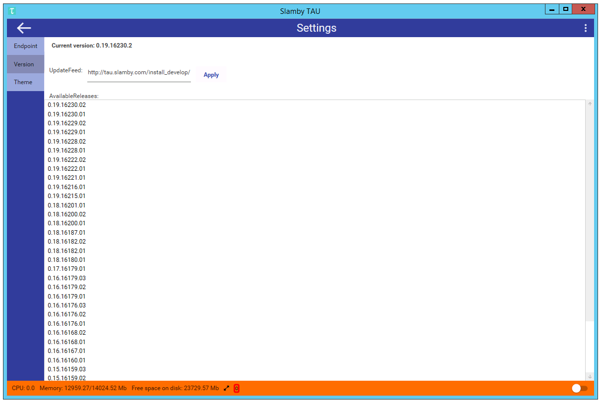

## Main Window

The first thing you see on your TAU is a structured window. On the top, you see the settings panel, on the left side the main menu items, on the bottom panel you see the status panel.

As the start tab, you see Dataset tab loaded.

> `Tip`: In TAU we use a tab-based design to support multitasking. To use tabs better you can drag tabs and organize them into multiple columns.

*Main window*:

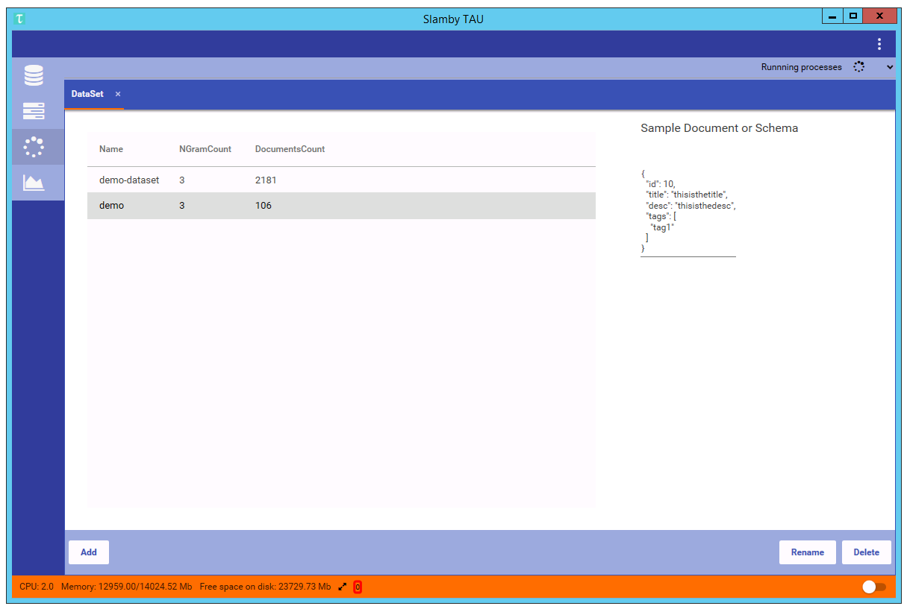

*Flexible design example*:

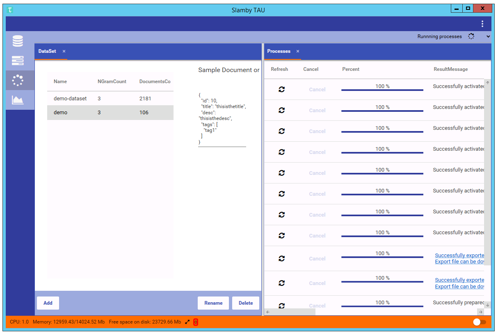

## Dataset

This is the tab where you can manage your dataset. On the left side, you see dataset list, on the right side you see the structure of the selected dataset. On the bottom menu panel, you see the available dataset functions.

`Dataset Columns`:

Name    |   Description
--- |   ---
Name    |   Dataset name. A-Z, 0-9. You can access your dataset by name. You can rename a dataset anytime.
Ngram   |   Dataset uses n-gram analysis in the background. This number displays the actual n-gram settings of a dataset. E.g.: 3 means n-gram settings: 1,2,3
Document count  |   This number shows the available, stored document number in the dataset.

> `Tip`: In you Slamby Server you can use dataset(s) to store and analyse your data. A dataset is a pre-designed, high capacity data storage engine that analyses your data real time.

`Built-in functions`:

Name    |   Description
--- |   ---
Import  |   Import documents or tags from JSON or CSV.
Rename  |   Rename dataset.
Clone   |   Create a new dataset by copying settings from a source dataset.
Remove  |   Remove dataset and its content and related settings.      

### Create a dataset:

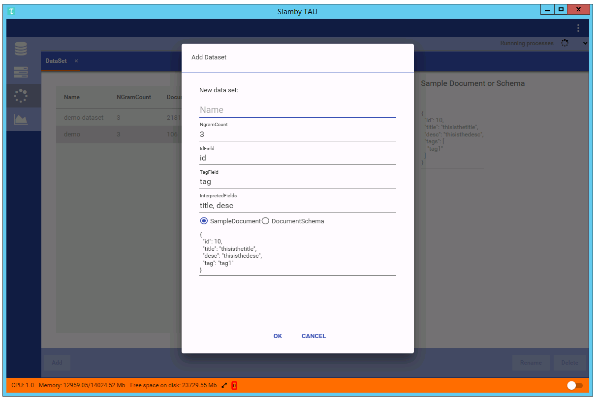

To create a dataset you need to provide basic settings.

`Available settings to create a dataset`:

Name    |   Default value   |   Description
--- |   --- |   ---
Name    |   empty   |   Name of the dataset. You can use a-z and 0-9. You can rename the dataset in the future.
NgramCount  |   3   |   Ngram settings. This number shows the n-gram number that is used by the dataset. We recommend using 3 as a value. Higher n-gram count means more precise text analysis, but higher server capacity.
IdField |   id  |   Which field is used as an id field in your sample document. The id field is required.
TagField    |   tag |   Which field is used as a tag field in your sample document. The tag field is required.
InterpretedFileds   |   title, desc  |   Interpreted fields are fields that we would like to use for text analysis in the future. We recommend using each text contained fields as interpreted fields.
SampleDocument  |   {...}   |   To create a dataset you can use a JSON sample document. In the sample, JSON document uses all the required fields and provide a required type. If you know perfectly which field types you would like to use please use DocumentSchema option and use directly schema.

> `Tip`: in a dataset, you can store as many fields as you wish. The quickest way to create a dataset is to use sample document. When you use sample document you can show to you server which is a sample from the required dataset structure that you would like to use. During dataset creating your Slamby Server analyses the sample document, reads all the fields and detect the basic field types.

### Create a dataset using schema:

To create a dataset with specific types you can use DocumentSchema option. Here you see a schema editor where you can type the required field names and types.

*Basic types*:

Name    |   Available types
--- |   ---
String  |   string
Numeric |   long,integer,short,byte,double,float
Date    |   date
Boolean |   boolean
Array   |   array
Object  |   object for single JSON object
Document    |   attachment accepts valid base64 encoded string

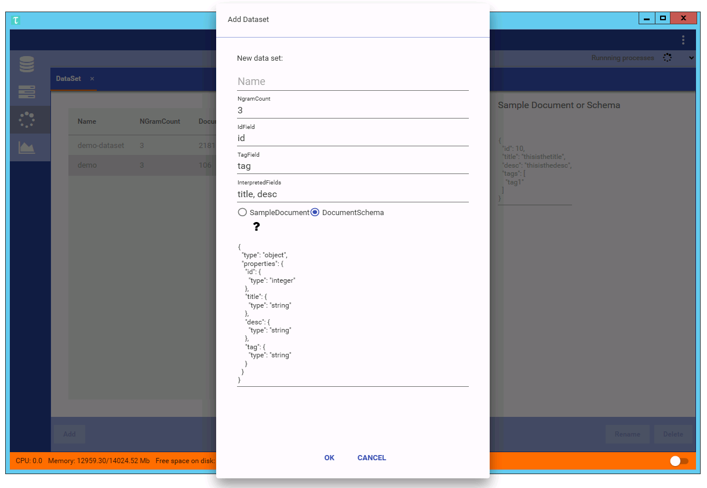

### Import documents or tags

Using TAU you can import documents or tags into a dataset from JSON or CSV file format.

To start import, use right click on the target dataset, then click the import document/tags from JSON/CSV.

## Documents

On document tab, you see a detailed document viewer and editor.

`Available functions`:

**List documents**. Document lister

**Add new document**. Click the `Add New` button. An empty sample document pops up. Fill it with the required content and click the save button.

**Edit document**. You can edit any opened document by simply re-write the content, then click the save button.

**Field filter**. You can select which document fields to display. Select the required fields in the `Fields` list (top right) and click the apply button.

**Tag management**. This is the sub-tab where you can manage your tags or categories in a dataset. Each dataset has one tag storage. Slamby manages categories as tags but organized into a parent-children hierarchy. To add, edit or remove any tags click the Tags tab.

**Document copy**. Your Slamby server comes with built-in document copy function. To copy a document into another dataset, select the required document(s) then use right-click and select copy to. A dataset selector pop-up where you can select the target dataset.

**Document move**. Built-in move function. Select the required document(s) then click the move button. A dataset selector pops up where you can select the target dataset.

**Delete document**. To delete the document(s), select the required items then click the remove menu.

**Clear tag list**. To remove all the related tag(s) from the selected document(s), select the required item(s) then click the clear tag list button. All the tags will be removed from the document(s).

**Copy all to**. To copy the whole dataset into another one, select Copy all to button. A dataset selector pops up where you can select the target dataset.

**Move all to**. To move the whole dataset into another one, select Copy all to button. A dataset selector pops up where you can select the target dataset.

**Sampling**. To create random selection select the sampling menu panel. Select the required tag, select the sampling method (stratified or simple), set the required sampling size and click the Get sample button. Generated sample will display in the document list.

**Search**. To search in your dataset select the filter panel on the right side. You can use logical expressions, field filters, and wildcard.   

*Document tab example*:

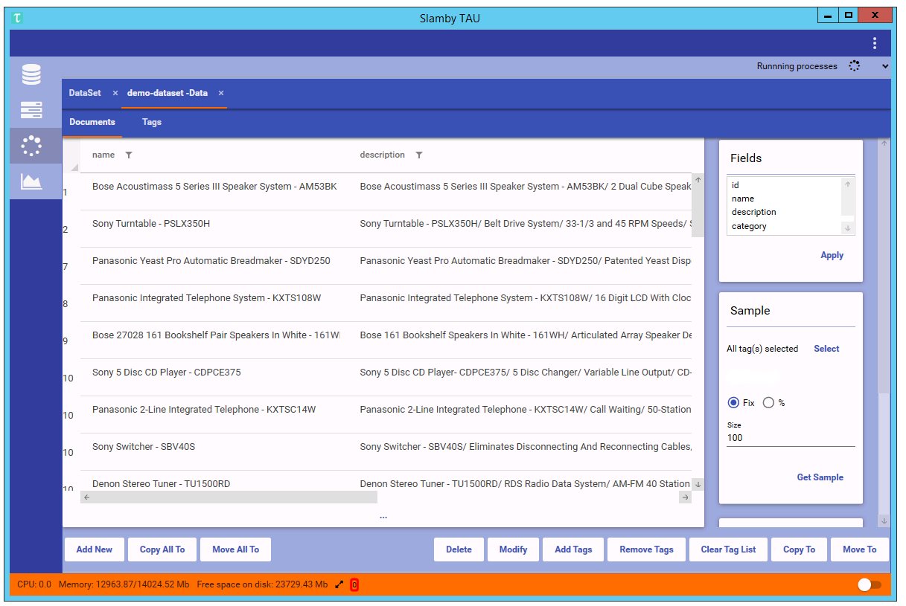

*Document filter example*:

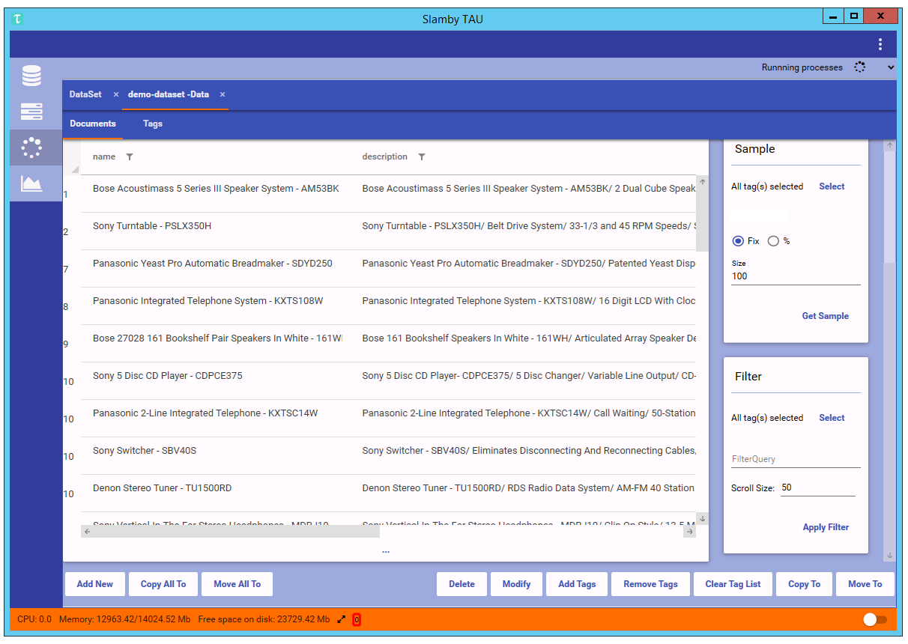

*Document tags tab example*:

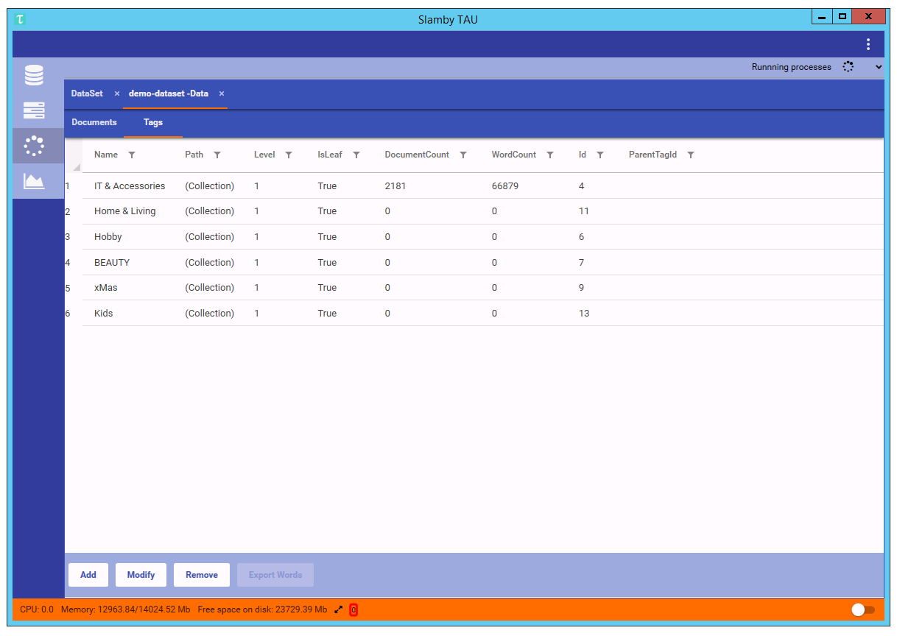

## Services

On this tab, you see your available services and create new ones.

> ˙Tip`: On your Slamby Server you can use services for text processing.

`Available service types`:

**Classifier service**. Text classification service. High accuracy level, language independent. Great for e-commerce classification or sentiment analysis.

**PRC service**. Similar document recommendation. Text analysis, machine-learning service. It recommends the most similar items within a given category/tag.

`Service creation steps`:

1. Create Empty Service,

2. Provide custom setting and start training/preparation,

3. Provide custom activation settings,

4. Activate service.

### Classifier Service

To create a classifier service click the create a new button on the bottom left corner. Select classifier service and click the new button. At first provide a required name, description and check the service type. When everything ready click the create button.

>`Tip`: To use a service you can use name, id or alias. For integration purpose, we suggest using the alias.

When a classifier service created the next step to start the preparation process. During preparation, machine learning process starts.

`Preparation settings`:

Name    |   Default value   |   Description
--- |   --- |   ---
DatasetName |   null    |   Dataset name as a source for machine learning. E.g. "demo-dataset".
NGramList   |   [1,2,3] |   Default ngram value. The maximum value depends on the ngram value of the source dataset.
CompressLevel   |   null    |   Built-in compress function. It can compress the training process. The same prediction quality but smaller resource need. We suggest using 1. Values can be 1,2,3.
TagIdList   |   null    | Tag ids that will participate in the training process. Null value means all the leaf categories in the category tree.

>`Tip`: On documents tab, you can select tags tab, where you can select the required tags. To copy the tag ids, select the required tags, then press ctrl+c that copies all the selected tag ids into your clipboard. In the prepare settings you can paste is by pressing ctrl+v. During the training process, you can check the training status and progress on the process tab.

When the preparation finishes you can activate it. During activation, the service loads into memory. After activation, you can use the service via Rest API.

**Activate a service**. To activate a service click the activate button. An activation settings panel pops up. Fill the required settings and click activate button again.

**Test a service**. To test an activated service click the recommend button. An input form pops up. Available settings: `Text`:input text, `Count`: top n result to display, `NeedTagInResult`: detailed result.

### PRC Service

To create a PRC service click the create a new button on the bottom left corner. Select PRC service and click the new button. At first type a suitable name, description, and alias. When everything ready click the create button.

>`Tip`: To use a service you can use a name, id or alias. For integration purpose, we suggest using the alias.

When a PRC service created the next step to start the preparation process. During preparation, machine learning process starts.

`Preparation settings`:

Name    |   Default value   |   Description
--- |   --- |   ---
DataSetName |   null    |   Dataset name as a source for machine learning. E.g. "demo-dataset".
TagIdList   |   null    |   Tag ids that will participate in the training process. Null value means all the leaf categories in the category tree.
CompressLevel   |   0   |   Built-in compress function. It can compress the training process. The same prediction quality but smaller resource need. We suggest using 1. Values can be 1,2,3.
CompressSettings    |   null    |   Detailed compress settings, for more information please contact `support@slamby.com`

**Activate a service**. To activate a PRC service, click the `activate` button. Required setting `FieldForRecommendation`: default value is null, field list from the source dataset. Similar item recommendation is based on the given fields. Default null value means all the interpreted text fields.

**Test a service**. To test a PRC service click the recommend button.

`Input fields for PRC recommend`

Name    |   Default value   |   Description
--- |   --- |   ---
Text    |   null    |   Text to analyse.
Count   |   3   |   Document count in the result.
NeedDocumentInResult    |   false   |   True: result documents are displayed, false: only document ids are displayed in the result.
TagId   |   null    |   Tag id in which the recommendation engine is looking for matching documents.
Filter  |   null    |   Filter object, matchmaking process starts on the filter results.
Weights |   []  |   Weigh list. Result order modification using fields and weight.

**Index**. When a PRC service is activated, for faster response time you can use our built-in index. When an index process starts, it analyses all the documents and stores the results in an index database. To start index process click the index button.

**Partial Index**. When an index process is finished, you can refresh your index database by using the partial index. To start partial index click the partial index button.

## Processes

Each long-term or calculation needed background process are organized as `process`. On this tab, you see your processes in historical order. You can check the running processes, status.

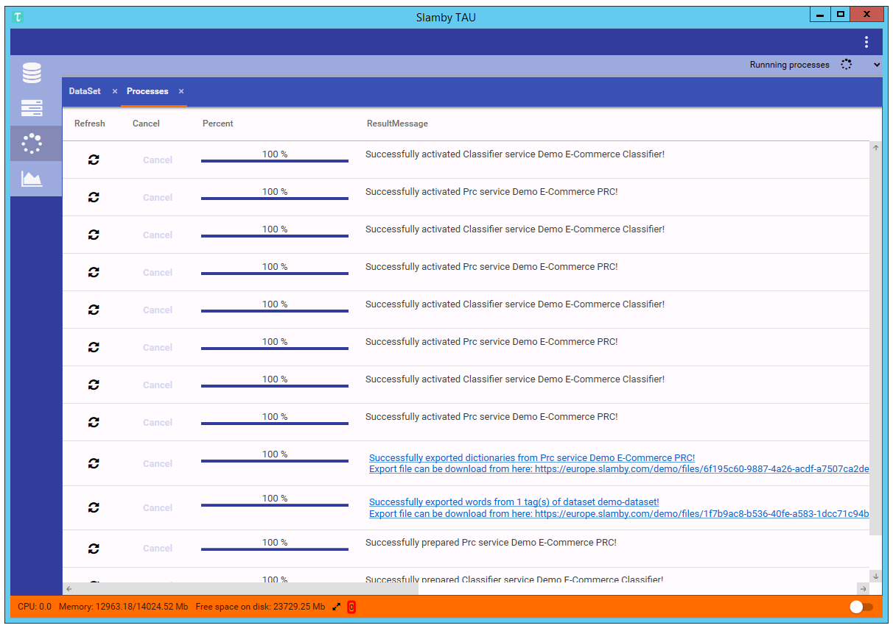

## Resource Management

Your Slamby Server and TAU comes with a built-in resource monitor. Using this tool you see real-time server usage statistics such as processor core number and load, memory capacity and load, storage size and load.

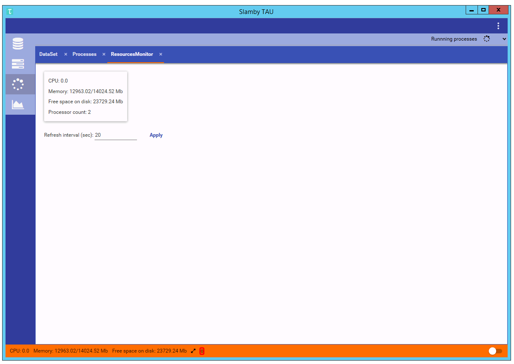

## Questions, Support

If you have any questions please contact us via `hello@slamby.com`, or `support@slamby.com`.

## Many thanks for third-party providers

<a href="https://github.com/JoshClose/CsvHelper" target="_blank">CsvHelper</a>

<a href="http://datagridextensions.codeplex.com/" target="_blank">DataGridExtensions</a>

<a href="https://dragablz.net/" target="_blank">Dragablz</a>

<a href="https://github.com/charri/Font-Awesome-WPF/" target="_blank">FontAwesome.WPF</a>

<a href="http://logging.apache.org/log4net/" target="_blank">log4net</a>

<a href="https://github.com/ButchersBoy/MaterialDesignInXamlToolkit" target="_blank">MaterialDesign (MaterialDesignThemes & MaterialDesignColors)</a>

<a href="http://www.galasoft.ch/mvvm" target="_blank">MvvmLight</a>

<a href="http://www.newtonsoft.com/json" target="_blank">Newtonsoft.Json</a>

<a href="https://github.com/squirrel/Squirrel.Windows" target="_blank">Squirrel.Windows</a>

---

2016 Hungary.
*Made from the heart by Slamby.*
