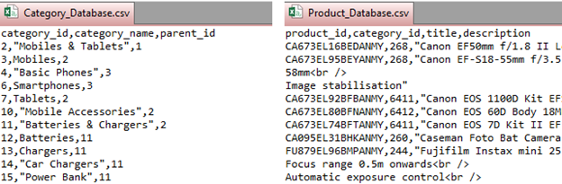
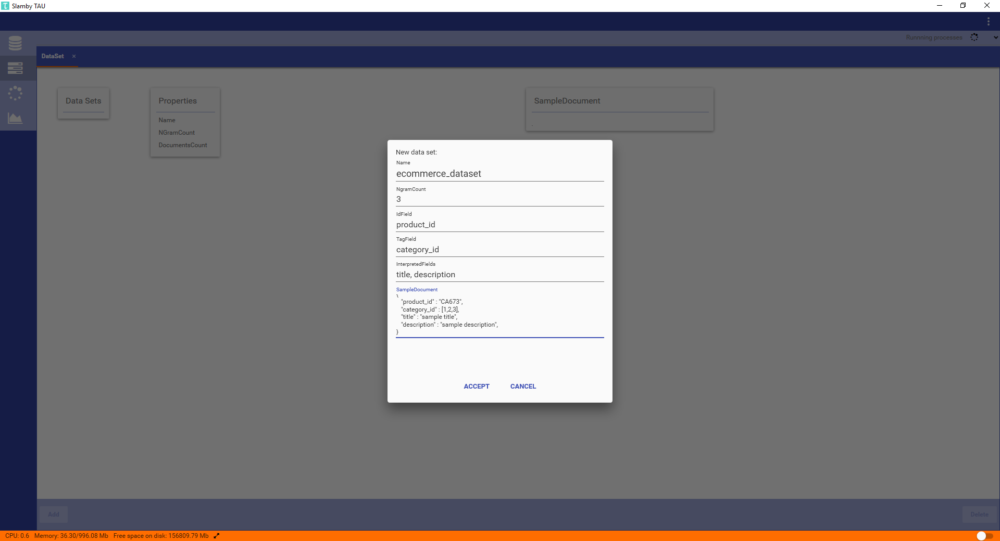
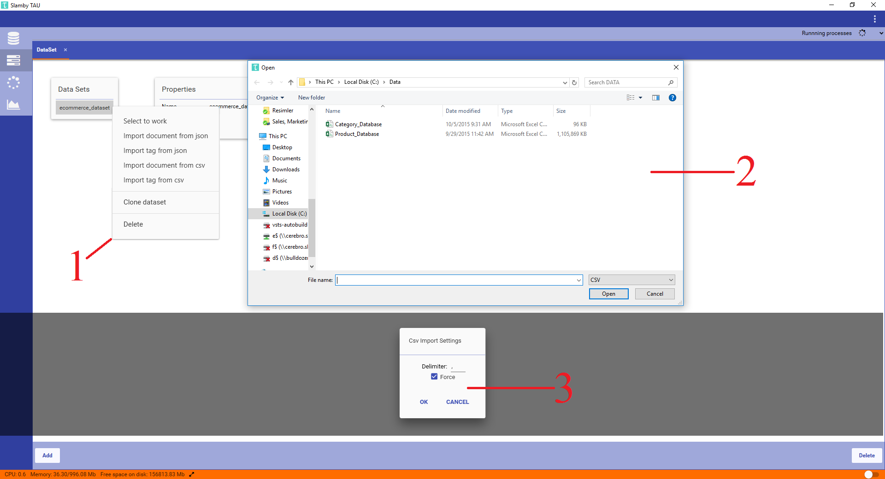
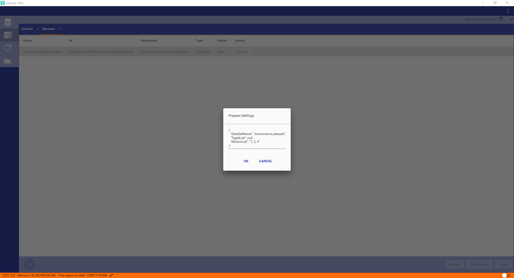
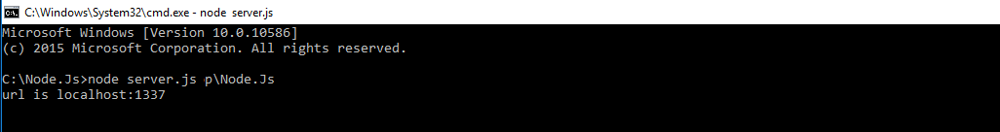
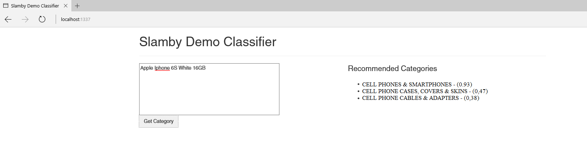

# **Slamby Category Recommendation in 9 Simple Steps**

This use case tutorial shows how easy to have high accurate and language independent category recommendation engine with Slamby. The tutorial covers the all steps from the beginning till the implementation to your website in Node.JS (JavaScript) language.

## **1. Description of Necessary Datas**

*Example Databases*



In order to build recommendation engine, you need to import category and product databases. Category database includes your e-commerce category tree and product database includes the products that displays on your e-commerce site. 

During the training process, Slamby will read and understand the text from the interpreted fields in your product database and learn how to categorize your digital products. After the training process, Slamby will be able to categorize or recommend your product with the most relevant categories from your category tree. 
 
Keep in mind that when the product quantity is higher, classifier accuracy will be higher as well. Especially when there is high amount of category in your database...  

Necessary fields inside of category database are ’Category ID’, ’Parent ID’ and ’Category Name’.
Necessary fields inside of product database are ’Category ID’, Product  ID’, ’Product Title’ and ’Product Description’. 

>**`Tips:`** You can have as much fields as you want in your product database in order to store, monitor, modify and analyze. Mentioned fields are necessary to build recommendation engine.

## **2. Creating a Dataset**

In order to speed up process and avoid complexity,  we are going to use **Slamby TAU**. TAU is a desktop application that makes you able to communicate with your Slamby Server directly to take quick actions. Click [here](https://www.slamby.com) to download `Slamby TAU`.

<a href="https://www.youtube.com/channel/UCQ6UfPZshXDIXT0zi3xRyHQ/playlists?shelf_id=0&view=1&sort=dd
" target="_blank"></a>

<iframe width="560" height="315" src="https://www.youtube.com/embed/0zhDeW_pQUU" frameborder="0" allowfullscreen></iframe>

For an additional information, you can manage all process by using your command line in several programming languages as well. To know how, visit our [Developers Site](https://www.google.com)

*Example TAU New Dataset Screen*


To create a dataset, first we need to fill a form with the following parameters:

**`Name:`** We will define name of our dataset. `ecommerce_dataset`

**`NgramCount:`** This count will determine the maximum n-gram value of our database that will be used during the classification. `Default value is "3"`

**`IdField:`** the ID field name from the sample database. `product_id`

**`TagField:`** the tag field name from the sample database. `category_id`

**`InterpretedFields:`** fields from the sample database which contains text to analyze. We want to analyze ad titles and descriptions to get best category recommendation. `title, description`

**`SampleDocument:`** We should define the schema of our product database. 

```
{
   "product_id" : "CA673",
   "category_id" : [1,2,3],
   "title" : "sample title",
   "description" : "sample description",
}```

## **3. Importing Data into the Dataset**

Next step is importing our product and category databases into the dataset. 

*Example TAU Data Import*


1. By right-click on created dataset, we can select to import document from ”csv or json” and import tag from ”csv or json”.

2. After selecting the right import format, we can select our source file using file browser.

3. Then, - a setting window pops-up. Here we can set the delimiter that will apply during CSV parsing. There is also a force import checkbox. Using force mode, all the errors will be detected and reported, but the import will be continued anytime. Not using Force mode, import process will stop when the first error detected.

>**`Tips:`** If you want to fix the errors inside of your database, don’t use force mode. In that time, Slamby will detect the mistakes particularly and you can easily fix those one by one.  

## **4. Creating a Recommendation Engine (Classifier Service)**

Next step is building text classification service using "Slamby Twister" technology.

*Example TAU Create New Service Screen*


To create a Classifier Service, we will provide the `required name` and the `short description` of it in order to recognize the service in our future actions. Select `Classifier` as a type of service, and click on the `‘Ok’` button. The service is going to be displayed in ‘New status’.

## **5. Preparation of Recommendation Engine**

Next step is preparation of 'Classifier Service' by providing our custom settings as a single JSON.

*Example TAU Preparation Setting Screen*


Name    |   Description
---     |   ---
DataSetName |   Source Dataset name that we are going to use to create Classifier Service. We will use `ecommerce_dataset` that we have created.
TagIdList   |   Tag IDs that we are going to use for classification. When we keep it as a `null`, all the Leaf Tag Ids will be used or we can provide the specific Tag IDs to be used for classification.
NGramList   |   We can set the n-gram list that we like to use during our classification. When we created our dataset, we defined our maximum ngram count as "3". Therefore, now we can type `[1, 2, 3]` to use trigram for our classifier.

```
{
  "DataSetName": "ecommerce_dataset",
  "TagIdList": null,
  "NGramList": [1, 2, 3]
}```

>**`Tips:`** to select your custom Tag Ids and paste it into the JSON setting, select your required Tags in Data>Tags, and press ctrl+c, then ctrl+v in the json document. The selected Tag IDs array will be pasted as a JSON array.

## **6. Activation of Recommendation Engine**

Next step is adjusting the activation settings of 'Classifier Service' in a JSON format.

*Example TAU Activation Setting Screen*


To use a 'Classifier Service', it needs to have `'Activated Status'`. During activation process, all the service related files load into the Server Memory and opening a dedicated API endpoints that is able to process our requests.

To activate the service, we can use custom activation settings.

Name    |   Description
---     |   ---
EmphasizedTagList |   Tag IDs to be used for emphasized classification. In this case the selected Tag Names will be modified the classification. We will keep it as `'null'` not to emphasize any tag.
TagIdList   |   We can select Tag IDs from the prepared list to use for classification. We will keep it as `'null'` to use all the prepared Tag IDs.
NGramList   |   Defines which n-gram model we would like to use during the classification. We already defined our maximum ngram model as trigram in previous steps. Now, we are able to run our recommendation engine in trigram. That's why, now we can type `[1,2,3]` for trigram.

```
{
  "EmphasizedTagIdList": null,
  "TagIdList": null,
  "NGramList": [1,2,3]
}```

##**7. Testing of Recommendation Engine**

Now, our recommendation engine is ready for testing...

*Example TAU Recommend Screen*


To test the service, we should fill the JSON setting input form with the available settings and to send our request to the Service API endpoint.

Name    |   Description
---     |   ---
Text |   Here, we can type the text to be analyzed by the Classifier Service. This text will be analyzed and service will show us the category recommendations. `"Apple Iphone 6S White 16GB"`
Count   |   We can adjust the counter to determine the quantity of recommended categories. We will type `3` to receive top 3 category recommendation as a result.
UseEmphasizing   |   When Emphasize function is enabled, here we can set to use it for classification. We keep it as `false` not to use emphasizing.
NeedTagInResult   |   When we value it `true`, we can see a detailed response by tags - such as 'Tag Id', 'Tag Name', 'Tag Parent ID' and related properties.
```
{
  "Text": "Apple Iphone 6S White 16GB",
  "Count": 3,
  "UseEmphasizing": false,
  "NeedTagInResult": true
}```

## **8. Integration using Slamby Node.Js SDK**

```javascript
var client = new slambySdk.ApiClient();
    client.basePath = "https://api.slamby.com/";
    client.defaultHeaders = {
        "Authorization": "API Secret"
    };

    var apiInstance = new slambySdk.ClassifierServiceApi(client);

    var id = "13feb4d8-cfd0-41ec-ac37-3c09380e1781"; // String | 

    var request = new slambySdk.ClassifierRecommendationRequest();
    request.text = req.body.text;
    request.count = "50";
    request.needTagInResult = true;

    var opts = { 
    'request': request
    };

    apiInstance.recommendService(id, opts).then(function(data) {
        res.send(data);
    }, function(error) {
    console.error(error);
    });
```

>**`Tips:`** You should modify the below listed items:
>>+ `client.basePath` with your 'Server URL'
+ `Authorization` with your Server API Secret
+  `ID` with your Classifier Service ID, which is created automatically after you created your service by using TAU.

## **9. Final Stage: Website Integration and Try Out!**

Open up your server file with the extension .js by using text editor (such as notepad). Just type out and modify the below code. Then, save it.

First, click [here](Node.Js.zip) to download the sample `index.html` and sample `server.js` files.

Finally, we can start the node `server.js` and we can try it out with the following url http://localhost:1337/




*Example of Slamby Recommendations*


>**`Tips:`** Quality Score related to the Tag. Number between 0-1, where **higher is better**. Score defines the probability relevant order, but Score is not probability.