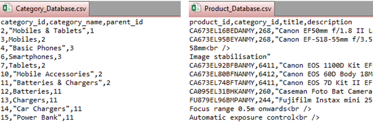
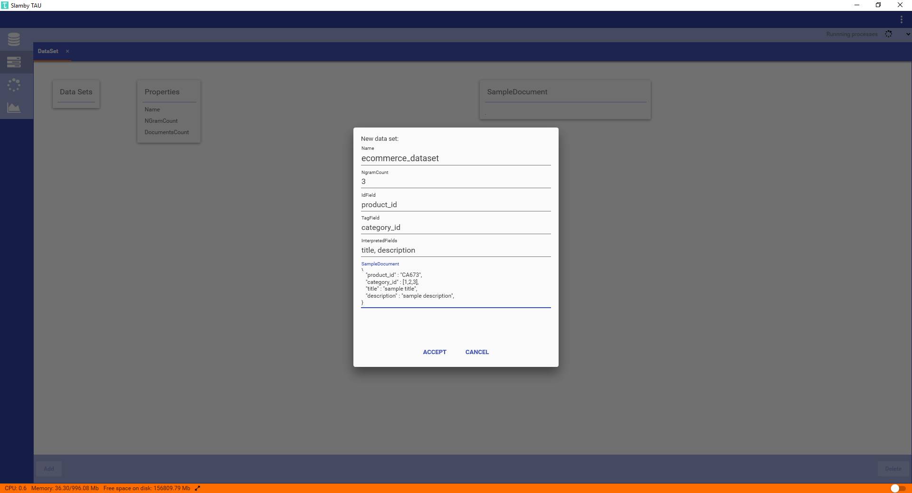
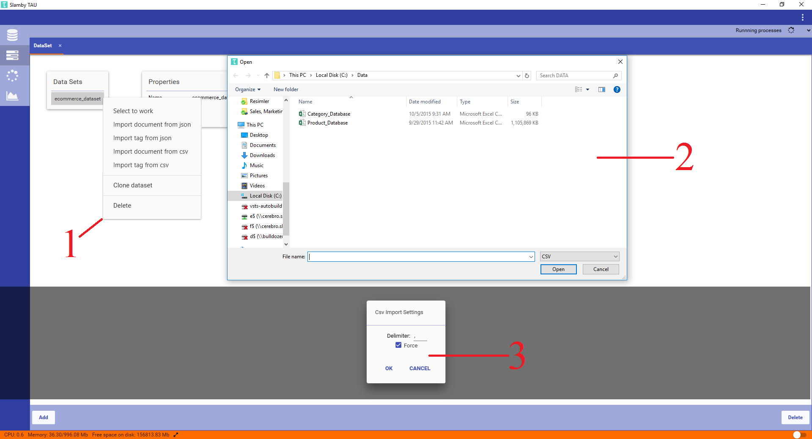
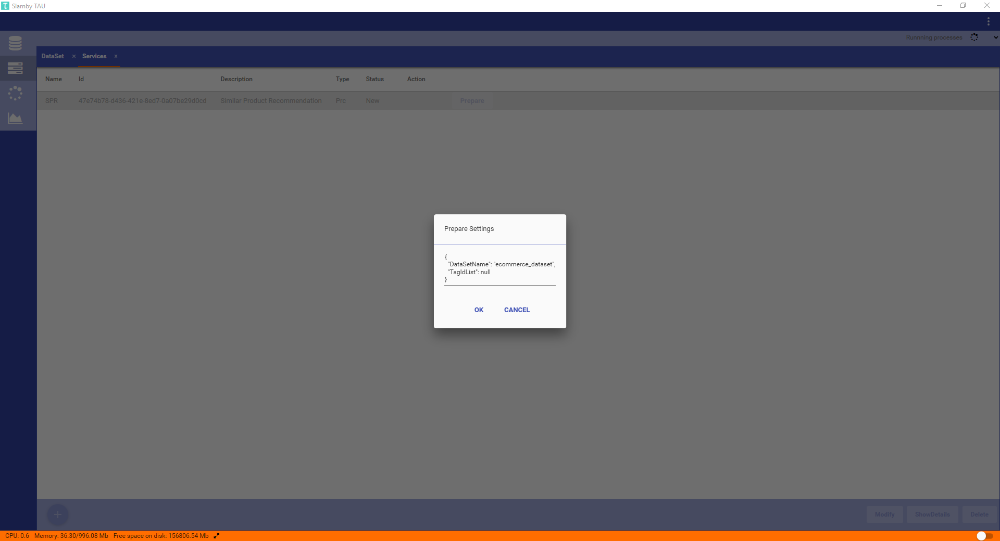
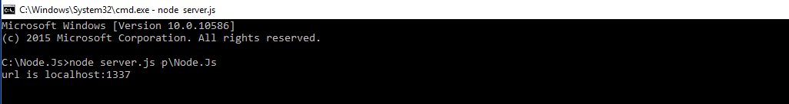
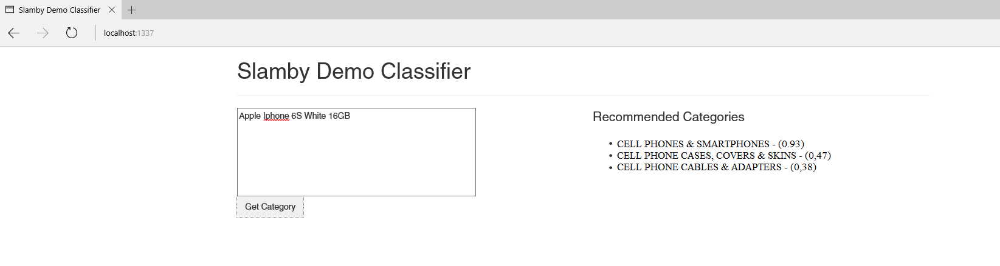

# **Slamby Similar Product Recommendation Engine (SPR) in 9 Simple Steps**

This use case tutorial shows how easy to have high accurate and language independent similar product recommendation engine with Slamby. The tutorial covers the all steps from the beginning till the implementation to your website in Node.JS (JavaScript) language.

## **1. Description of Necessary Datas**
*Example Databases*



In order to build similar product recommendation engine, you need to import category and product databases. Category database includes your e-commerce category tree and product database includes the products that displays on your e-commerce site. 

During the training process, Slamby will read and understand the text from the interpreted fields in your product database and learn how to categorize your digital products. After the training process, Slamby will be able to recommend similar products with the most relevant products from your product database. 
 
Necessary fields inside of category database are ’Category ID’, ’Parent ID’ and ’Category Name’.
Necessary fields inside of product database are ’Category ID’, Product  ID’, ’Product Title’ and ’Product Description’. 

>**`Tips:`** You can have as much fields as you want in your product database in order to store, monitor, modify and analyze. Mentioned fields are necessary to build recommendation engine.

## **2. Creating a Dataset**
In order to speed up process and avoid complexity,  we are going to use **Slamby TAU**. TAU is a desktop application that makes you able to communicate with your Slamby Server directly to take quick actions. Click [here](https://www.slamby.com) to download `Slamby TAU`.

<a href="https://www.youtube.com/channel/UCQ6UfPZshXDIXT0zi3xRyHQ/playlists?shelf_id=0&view=1&sort=dd
" target="_blank"></a>

For an additional information, you can manage all process by using your command line in several programming languages as well. To know how, visit our [Developers Site](https://www.google.com)

*Example TAU New Dataset Screen*


To create a dataset, first we need to fill a form with the following parameters:

**`Name:`** We will define name of our dataset. `ecommerce_dataset`

**`NgramCount:`** This count will determine the maximum n-gram value of our database that will be used during the classification. `Default value is "3"`

**`IdField:`** the ID field name from the sample database. `product_id`

**`TagField:`** the tag field name from the sample database. `category_id`

**`InterpretedFields:`** fields from the sample database which contains text to analyze. We want to analyze ad titles and descriptions to get best recommendation. `title, description`

**`SampleDocument:`** We should define the schema of our product database.

```
{
   "product_id" : "CA673",
   "category_id" : [1,2,3],
   "title" : "sample title",
   "description" : "sample description",
}```

## **3. Importing Data into the Dataset**
Next step is importing our product and category databases into the dataset. 

*Example TAU New Dataset Screen*


1. By right-click on created dataset, we can select to import document from ”csv or json” and import tag from ”csv or json”.

2. After selecting the right import format, we can select our source file using file browser.

3. Then, - a setting window pops-up. Here we can set the delimiter that will apply during CSV parsing. There is also a force import checkbox. Using force mode, all the errors will be detected and reported, but the import will be continued anytime. Not using Force mode, import process will stop when the first error detected.

>**`Tips:`** If you want to fix the errors inside of your database, don’t use force mode. In that time, Slamby will detect the mistakes particularly and you can easily fix those one by one.  

## **4. Creating a Similar Product Recommendation Engine (PRC Service)**
Next step is building PRC service using "Slamby Twister" technology.

*Example TAU Create New Service Screen*


To create a PRC Service, we will provide the `required name` and the `short description` of it in order to recognize the service in our future actions. Select `Prc` as a type of service, and click on the `‘Ok’` button. The service is going to be displayed in ‘New status’.

## **5. Preparation of SPR Engine**
Next step is preparation of 'PRC Service' by providing our custom settings as a single JSON.

*Example TAU Preparation Setting Screen*


Name    |   Description
---     |   ---
DataSetName |   Source Dataset name that we are going to use to create PRC Service. We will use `ecommerce_dataset` that we have created.
TagIdList   |   Tag IDs that we are going to use for SPR. We will keep it as `null`, all the Leaf Tag Ids will be used or we can provide the specific Tag IDs to be used for SPR.

```
{
  "DataSetName": "ecommerce_dataset",
  "TagIdList": null
}```

>**`Tips:`** to select your custom Tag Ids and paste it into the JSON setting, select your required Tags in Data>Tags, and press ctrl+c, then ctrl+v in the json document. The selected Tag IDs array will be pasted as a JSON array.

## **6. Activation of SPR Engine**
Next step is adjusting the activation settings of 'PRC Service' in a JSON format.

*Example TAU Activation Setting Screen*


To activate the PRC Service, we can define interpreted fields for recommendation. But now, we will keep it as `'Null'` to use all the fields.

```
{
  "FieldsForRecommendation": null
}```

## **7. Testing of Similar Product Recommendation Engine**
Now, our recommendation engine is ready for testing...

*Example TAU Recommend Screen*


To test the service, we should fill the JSON setting input form with the available settings and to send our request to the Service API endpoint.

Name    |   Description
---     |   ---
Text |   Here, we can type the text to be analyzed by the PRC Service. This text will be analyzed and service will show us the similar product recommendations. `"Limited Edition iPhone 6s 128GB Custom Matte Black Gold Logo & Buttons"`
Count   |   We can adjust the counter to determine the quantity of recommended products. We will type `5` to receive 5 most similar similar products as a result.
NeedDocumentInResult   |   We can set the Need document in result as `true` in order to receive full detailed document response. 
TagId   |   We can set the TagID to determine the Target Tag ID where the analysis is going to be processed. We will keep it as `null` add all the Leaf Tag Ids will be used.
Filter   |  By using Filter, we can make the analysis on the filtered documents. But, we will keep it as `null` and all the documents will be used for the analysis.
Weights   |  By using Weight, we can customize our fields in an order. But, we will keep it as `null` and the results will be in an order according to the score.
```
{
  "Text": "Limited Edition iPhone 6s 128GB Custom Matte Black Gold Logo & Buttons",
  "Count": 5,
  "NeedDocumentInResult": true,
  "TagId": null,
  "Filter": null,
  "Weights": null
}```

## **8. Slamby SDK with Node.JS (JavaScript) Language**
Open up your server file with the extension .js by using text editor (such as notepad). Just type out and modify the below code. Then, save it.

```javascript
var client = new slambySdk.ApiClient();
    client.basePath = "https://api.slamby.com/";
    client.defaultHeaders = {
        "Authorization": "API Secret"
    };

    var apiInstance = new slambySdk.ClassifierServiceApi(client);

    var id = "13feb4d8-cfd0-41ec-ac37-3c09380e1781"; // String | 

    var request = new slambySdk.ClassifierRecommendationRequest();
    request.text = req.body.text;
    request.count = "50";
    request.needTagInResult = true;

    var opts = { 
    'request': request
    };

    apiInstance.recommendService(id, opts).then(function(data) {
        res.send(data);
    }, function(error) {
    console.error(error);
    });
```

Click [here](https://www.slamby.com) to download the sample `server.js` file that we have already prepared for you.

>**`Tips:`** You should modify the below listed items:
>>+ `client.basePath` with your 'Server URL'
+ `Authorization` with your Server API Secret
+  `ID` with your Classifier Service ID, which is created automatically after you created your service by using TAU.

## **9. Final Stage: Website Integration and Try Out!**
First, click [here](https://www.slamby.com) to download the sample `index.html` file.

Finally, we can start the node `server.js` and we can try it out with the following url http://localhost:1337/




*Example of Slamby Recommendations*


>**`Tips:`** Quality Score related to the Tag. Number between 0-1, where **higher is better**. Score defines the probability relevant order, but Score is not probability.

